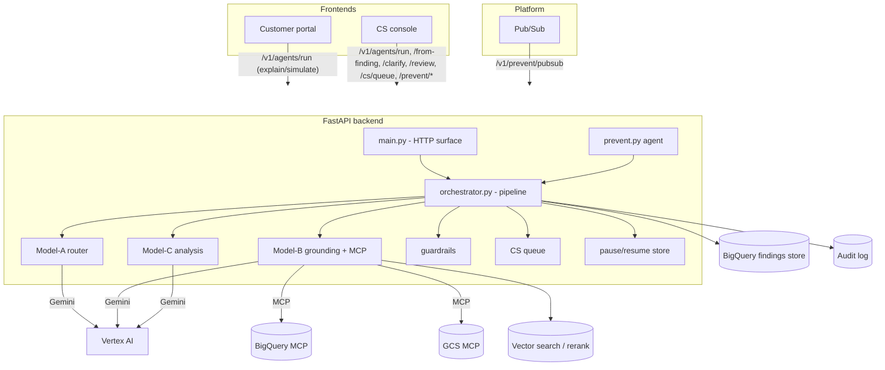
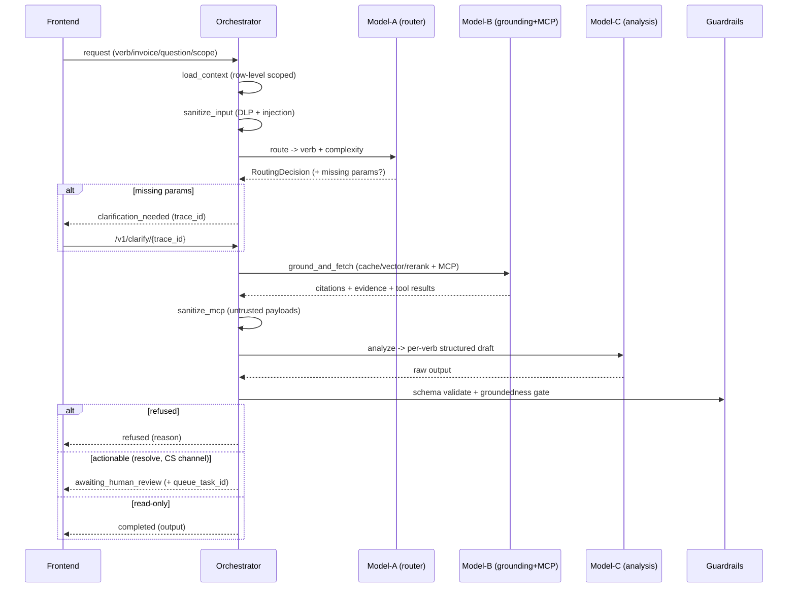
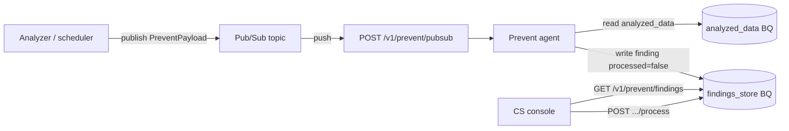

# Invoice Processing SaaS — Backend

Async **FastAPI** backend for an enterprise invoice-processing assistant built around
**four agents (verbs)** — **Explain**, **Resolve**, **Simulate**, **Prevent** — powered by a
**three-model pipeline** on **Vertex AI Gemini**, grounded through **MCP** tools over
BigQuery / Cloud Storage, and gated by automated guardrails plus mandatory human
approval for actionable output.

This document is the single source of truth for **integrating and communicating with the
backend** from the frontend (customer portal + CS console) and from platform components
(Pub/Sub, BigQuery, MCP servers, Vertex AI).

> Status: the business logic, routing, guardrails, pause/resume, queues and the full HTTP
> surface are complete and runnable. External integrations (Gemini calls, real BigQuery,
> GCS, DLP, Pub/Sub auth, MCP transport) are clearly marked `# TODO(placeholder):` and
> return representative stubs so the entire flow works end-to-end in dev.

---

## Table of contents

1. [Concepts: the 4 agents](#1-concepts-the-4-agents)
2. [Architecture](#2-architecture)
3. [The three-model pipeline](#3-the-three-model-pipeline)
4. [Trigger paths](#4-trigger-paths)
5. [Project structure](#5-project-structure)
6. [Getting started](#6-getting-started)
7. [Configuration reference](#7-configuration-reference)
8. [HTTP API reference](#8-http-api-reference)
9. [Data models](#9-data-models)
10. [Frontend integration guide](#10-frontend-integration-guide)
11. [Prevent event flow (Pub/Sub)](#11-prevent-event-flow-pubsub)
12. [System prompts](#12-system-prompts)
13. [MCP, BigQuery & NL→SQL](#13-mcp-bigquery--nlsql)
14. [Guardrails & security](#14-guardrails--security)
15. [Observability & SLOs](#15-observability--slos)
16. [Integration checklist (placeholders)](#16-integration-checklist-placeholders)

---

## 1. Concepts: the 4 agents

| Verb | Purpose | Actionable? | Human approval | How it is triggered |
|------|---------|-------------|----------------|---------------------|
| **explain** | Explain why a charge/finding exists (read-only, cited). | No | No | Interactive (Path A/B, general) |
| **resolve** | Recommend a corrective action (credit, dispute, re-rate). | **Yes** | **Mandatory (CS)** | Interactive (Path A/B, general) |
| **simulate** | Project a what-if outcome from scenario parameters. | No | No | Interactive (Path A/B, general) |
| **prevent** | Find root cause of recurring issues + preventive controls. | Yes | **CS processes the finding** | **Event-driven (Pub/Sub only)** |

Key rules enforced by the backend:

- **Prevent is never user-selectable** on the interactive endpoints — it only runs from a
  Pub/Sub event. Attempting `verb=prevent` on `/v1/agents/run` or `/from-finding` returns **422**.
- **Resolve requires a human.** On the CS channel it is queued for approval; on the customer
  self-service portal it is **refused** (no CS human present).
- Every output is **schema-validated + groundedness-gated** before any human sees it.

---

## 2. Architecture



---

## 3. The three-model pipeline

Every interactive request flows through the orchestrator's traced stages
([app/orchestrator.py](app/orchestrator.py)):



| Model | Role | Config key | Default | File |
|-------|------|-----------|---------|------|
| **Model-A** | Intent + complexity routing | `router_model_id` | `gemini-2.5-flash` | [app/agents.py](app/agents.py) `ModelA` |
| **Model-B** | Grounding + MCP tool use + NL→SQL; tier scales with complexity | `model_easy_id` / `model_medium_id` / `model_complex_id` | `flash-lite` / `flash` / `pro` | [app/agents.py](app/agents.py) `ModelB` |
| **Model-C** | Per-verb analysis + structured drafting | `analysis_model_id` | `gemini-2.5-pro` | [app/agents.py](app/agents.py) `ModelC` |

The single Gemini entry point is [app/llm.py](app/llm.py) `invoke_llm(...)` — swap its body
for a real Vertex AI call and every model goes live at once.

---

## 4. Trigger paths

There are **four** ways work enters the backend:

| Path | Endpoint | Who | Verb chosen by | Notes |
|------|----------|-----|----------------|-------|
| **General** | `POST /v1/process` | Any | **Model-A auto-routes** | Free-form question; needs `finding_id` or `invoice_number`. |
| **Path A** | `POST /v1/agents/from-finding/{finding_id}` | CS | Caller (explicit) | CS clicked an invoice in the Prevent queue. |
| **Path B** | `POST /v1/agents/run` | Customer/CS | Caller (explicit) | Pick agent + invoice + date. |
| **Event** | `POST /v1/prevent/pubsub` | Pub/Sub | Prevent (fixed) | Kicks off the Prevent agent. |

Path A and Path B accept **only** `explain`, `resolve`, `simulate`.

---

## 5. Project structure

```
backend/
├─ README.md                 ← this file
├─ requirements.txt          ← runtime deps (+ commented placeholders to enable)
├─ .env.example              ← copy to .env and fill in
└─ app/
   ├─ main.py                ← FastAPI app + all HTTP endpoints
   ├─ orchestrator.py        ← the pipeline (Process 1 + Process 2), pause/resume
   ├─ agents.py              ← Model-A / Model-B / Model-C
   ├─ prevent.py             ← event-driven Prevent agent
   ├─ schemas.py             ← Pydantic enums, requests, responses, per-verb outputs
   ├─ config.py              ← Settings (pydantic-settings, .env)
   ├─ llm.py                 ← single Vertex AI Gemini entry point (placeholder)
   ├─ mcp_clients.py         ← BigQuery MCP + GCS MCP clients (placeholder)
   ├─ retrieval.py           ← semantic cache + vector search + rerank (placeholder)
   ├─ guardrails.py          ← input sanitization + output schema/groundedness gate
   ├─ gcp.py                 ← BigQuery/GCS/DLP clients + findings store (POC in-memory)
   ├─ cs_queue.py            ← CS approval queue (POC in-memory)
   ├─ store.py               ← pause/resume state for clarify + review (POC in-memory)
   ├─ feedback.py            ← audit + finding-status + tuning signal
   ├─ telemetry.py           ← per-stage tracing + SLO
   └─ prompts/               ← editable system-prompt registry (Markdown)
      ├─ __init__.py         ← loader: router_system(), grounding_system(), nl2sql_system(), analysis_system(verb)
      ├─ model_a_router.md
      ├─ model_b_grounding.md
      ├─ nl2sql.md
      ├─ model_c_explain.md
      ├─ model_c_resolve.md
      ├─ model_c_simulate.md
      └─ model_c_prevent.md
```

---

## 6. Getting started

### Prerequisites
- Python 3.11+ (developed on 3.14)
- A virtual environment (a `.venv` already exists in this folder)

### Install
```powershell
cd backend
python -m venv .venv                       # if not already present
.\.venv\Scripts\python.exe -m pip install -r requirements.txt
Copy-Item .env.example .env                # then fill in real values
```

### Run the API
```powershell
.\.venv\Scripts\python.exe -m uvicorn app.main:app --reload --port 8000
```

- Interactive docs (Swagger UI): `http://localhost:8000/docs`
- OpenAPI schema (for client codegen): `http://localhost:8000/openapi.json`
- Health check: `http://localhost:8000/health`

### CORS (required for browser frontends)
The app does not enable CORS by default. For a browser frontend, add this near the top of
[app/main.py](app/main.py):

```python
from fastapi.middleware.cors import CORSMiddleware

app.add_middleware(
    CORSMiddleware,
    allow_origins=["https://your-frontend.example.com"],  # or ["*"] in dev
    allow_methods=["*"],
    allow_headers=["*"],
)
```

---

## 7. Configuration reference

All settings live in [app/config.py](app/config.py) and load from `.env` (see
[.env.example](.env.example)). Env var names are the UPPER_SNAKE_CASE of each field.

| Env var | Default | Purpose |
|---------|---------|---------|
| `APP_NAME` / `ENVIRONMENT` | `Invoice Processing SaaS` / `dev` | App metadata |
| `GCP_PROJECT_ID` / `GCP_LOCATION` | `REPLACE_ME` / `us-central1` | GCP project + region |
| `BIGQUERY_DATASET` | `REPLACE_ME` | Dataset holding the tables below |
| `BIGQUERY_ANALYZED_TABLE` | `analyzed_data` | Pre-analyzed rows (Prevent input) |
| `BIGQUERY_FINDINGS_TABLE` | `findings_store` | Where Prevent findings are written |
| `GCS_BUCKET` / `INVOICE_RESOURCE_URI` | `REPLACE_ME` | Invoice document store |
| `CS_QUEUE_BACKEND` | `REPLACE_ME` | Durable backing for the CS queue |
| `PREVENT_SUBSCRIPTION` | `REPLACE_ME` | Pub/Sub subscription feeding Prevent |
| `PREVENT_FINDINGS_WINDOW_MINUTES` | `60` | "Recent findings" listing window |
| `ROUTER_MODEL_ID` | `gemini-2.5-flash` | Model-A |
| `MODEL_EASY_ID` / `MODEL_MEDIUM_ID` / `MODEL_COMPLEX_ID` | `flash-lite` / `flash` / `pro` | Model-B tiers |
| `ANALYSIS_MODEL_ID` | `gemini-2.5-pro` | Model-C |
| `VERTEX_API_ENDPOINT` | `us-central1-aiplatform.googleapis.com` | Vertex endpoint |
| `BIGQUERY_MCP_URL` / `GCS_MCP_URL` | `REPLACE_ME` | MCP server URLs |
| `MCP_TIMEOUT_SECONDS` | `30` | MCP call timeout |
| `VECTOR_INDEX_ENDPOINT` / `RERANK_MODEL_ID` | `REPLACE_ME` | Retrieval/grounding |
| `SEMANTIC_CACHE_TTL_SECONDS` | `3600` | Semantic cache TTL |
| `RETRIEVAL_TOP_K` / `RERANK_TOP_N` | `20` / `5` | Retrieval sizing |
| `RAGAS_GROUNDEDNESS_THRESHOLD` | `0.7` | Refuse-if-ungrounded gate |
| `DLP_TEMPLATE_NAME` | `REPLACE_ME` | Cloud DLP de-identify template |
| `EXPLAIN_SLO_SECONDS` | `5` | Explain latency SLO |

---

## 8. HTTP API reference

Base URL: `http://<host>:8000`. All bodies are JSON. All timestamps are ISO-8601 UTC.

### `GET /health`
Liveness probe.
```json
200 → {"status": "ok"}
```

---

### `POST /v1/process` — general (auto-routed)
Model-A picks the verb from `user_question`. Requires **either** `finding_id` **or**
`invoice_number`.

Request ([`ProcessRequest`](#processrequest)):
```json
{
  "user_question": "Why is invoice INV-501 higher than last month?",
  "invoice_number": "INV-501",
  "as_of_date": "2026-07-02",
  "channel": "cs",
  "user": {"user_id": "cs-1", "roles": ["cs"], "contract_ids": ["C-1"], "geo": "US", "currency": "USD"}
}
```
Response: [`ProcessResponse`](#processresponse). Status may be `completed`,
`clarification_needed`, `awaiting_human_review`, `refused`, or `error`.

---

### `POST /v1/agents/run` — Path B (choose agent + invoice + date)
Request ([`AgentRunRequest`](#agentrunrequest)):
```json
{
  "verb": "simulate",
  "invoice_number": "INV-500",
  "as_of_date": "2026-07-01",
  "user_question": "Simulate a rate change",
  "scenario_params": {"new_rate": 1.25, "quantity": 10},
  "channel": "cs",
  "user": {"user_id": "cs-1", "roles": ["cs"], "contract_ids": ["C-1"]}
}
```
- `verb` must be `explain` | `resolve` | `simulate` (else **422**).
- For `simulate` with no `scenario_params`, the response is `clarification_needed`.

Response: [`ProcessResponse`](#processresponse).

---

### `POST /v1/agents/from-finding/{finding_id}` — Path A (from Prevent queue)
Path param: `finding_id` (from a Prevent finding). Request
([`AgentFromFindingRequest`](#agentfromfindingrequest)):
```json
{
  "verb": "resolve",
  "user_question": "Resolve this finding",
  "channel": "cs",
  "user": {"user_id": "cs-1", "roles": ["cs"], "contract_ids": ["C-1"]}
}
```
The backend loads the finding's context automatically. `verb` restricted to the three
interactive verbs. Response: [`ProcessResponse`](#processresponse).

---

### `POST /v1/clarify/{trace_id}` — answer a clarification & resume
Send this when a previous response returned `status = "clarification_needed"`. Use the same
`trace_id`.

Request ([`ClarifyRequest`](#clarifyrequest)):
```json
{"scenario_params": {"new_rate": 1.25, "quantity": 10}}
```
- `404` if there is no pending clarification for `trace_id`.
- Response: [`ProcessResponse`](#processresponse) (the resumed result).

---

### `POST /v1/review/{trace_id}` — CS approve / modify / reject (Resolve)
Send this when a response returned `status = "awaiting_human_review"`.

Request ([`HumanReviewPayload`](#humanreviewpayload)):
```json
{"decision": "accept", "reviewer_id": "cs-1", "reason_code": "correct"}
```
- `decision`: `accept` | `modify` | `reject`. For `modify`, include `edited_output`
  (re-validated against the verb schema; **422** if invalid).
- `404` if there is no pending review for `trace_id`.
- Response: [`ProcessResponse`](#processresponse) with `status = "completed"` and the final
  `finding_status`.

---

### `GET /v1/cs/queue` — CS approval queue
Query params: `assignee` (optional). Returns items awaiting human approval
(currently Resolve).
```json
200 → [ CSQueueTask, ... ]   // see #csqueuetask
```

---

### `POST /v1/prevent/pubsub` — Pub/Sub push → Prevent agent
Accepts the standard Pub/Sub push envelope ([`PubSubPushEnvelope`](#pubsub-models)). The
`message.data` is base64-encoded JSON of a [`PreventPayload`](#preventpayload); if absent,
`message.attributes` are used.

Request:
```json
{
  "message": {"data": "<base64 of {\"invoice_number\":\"INV-777\",\"analyzed_data_ref\":\"row-42\",\"contract_ids\":[\"C-1\"]}>", "messageId": "m-1"},
  "subscription": "projects/p/subscriptions/prevent-sub"
}
```
Response:
```json
200 → {"finding_id": "PF-9cde66b79257", "status": "open"}
```
- `400` on an undecodable payload.

---

### `GET /v1/prevent/findings` — CS "recent findings" list
Query params: `user_id` (default `cs`), `window_minutes` (default from config = 60),
`only_unprocessed` (default `true`). Lists Prevent findings written in the last window.
```json
200 → [ PreventFinding, ... ]   // see #preventfinding
```

---

### `POST /v1/prevent/findings/{finding_id}/process` — CS processed a finding
Flips the `processed` flag in the findings store and updates status.

Request ([`ProcessFindingRequest`](#processfindingrequest)):
```json
{"reviewer_id": "cs-1", "status": "resolved", "comment": "Applied preventive control."}
```
- `404` if the finding does not exist.
- Response: the updated [`PreventFinding`](#preventfinding) (`processed = true`).

---

### `POST /v1/feedback` — standalone structured feedback
Request ([`FeedbackPayload`](#feedbackpayload)):
```json
{"trace_id": "…", "decision": "accept", "reason_code": "correct", "reviewer_id": "cs-1"}
```
Response:
```json
200 → {"trace_id": "…", "finding_status": "resolved"}
```

### Status-code summary
| Code | When |
|------|------|
| `200` | Success (including business statuses like `refused` inside the body) |
| `400` | Bad Pub/Sub payload |
| `404` | No pending clarify/review for `trace_id`; finding not found |
| `422` | Validation error (e.g. `prevent` on interactive endpoints, `modify` without `edited_output`, malformed body) |

---

## 9. Data models

Defined in [app/schemas.py](app/schemas.py). Enums:

- **Verb**: `explain` `resolve` `simulate` `prevent`
- **Complexity**: `easy` `medium` `complex`
- **Channel**: `cs` (human available) · `customer` (self-service, no human)
- **PipelineStatus**: `completed` `clarification_needed` `awaiting_human_review` `refused` `error`
- **ReviewDecision**: `accept` `modify` `reject`
- **ReasonCode**: `correct` `incomplete` `inaccurate` `ungrounded` `policy_violation` `other`
- **FindingStatus**: `open` `in_review` `resolved` `rejected` `escalated`
- **TriggerSource**: `prevent_queue` `direct` `auto` `event`

### UserContext
Caller identity **and** the row-level security scope applied to every MCP/BQ read.
```jsonc
{
  "user_id": "cs-1",
  "roles": ["cs"],
  "contract_ids": ["C-1"],   // restricts retrieval + queries
  "geo": "US",
  "currency": "USD"
}
```

### ProcessRequest
`user_question` (req), `finding_id`?, `invoice_number`?, `as_of_date`?, `forced_verb`?,
`trigger_source` (default `auto`), `scenario_params` {}, `channel` (default `cs`),
`user` (req). Requires `finding_id` **or** `invoice_number`.

### AgentRunRequest
`verb` (req, interactive only), `invoice_number` (req), `user_question`, `as_of_date`?,
`scenario_params` {}, `channel`, `user` (req).

### AgentFromFindingRequest
`verb` (req, interactive only), `user_question`, `scenario_params` {}, `channel`, `user` (req).

### ClarifyRequest
`answers` {}, `scenario_params` {}, `finding_id`?, `invoice_number`?.

### HumanReviewPayload
`decision` (req), `reviewer_id` (req), `edited_output`? (required for `modify`),
`reason_code` (default `correct`), `comment`?.

### FeedbackPayload
`trace_id`, `decision`, `reason_code`, `reviewer_id`, `comment`?.

### PreventPayload
`invoice_number`?, `finding_id`?, `analyzed_data_ref`?, `contract_ids` [], `geo`?, `currency`?.

### PubSub models
`PubSubMessage` = `data`? (base64 JSON) · `messageId`? · `attributes` {}.
`PubSubPushEnvelope` = `message` · `subscription`?.

### ProcessFindingRequest
`reviewer_id` (req), `status` (default `resolved`), `comment`?.

### ProcessResponse
The universal envelope returned by process/agents/clarify/review:
```jsonc
{
  "trace_id": "…",
  "status": "completed|clarification_needed|awaiting_human_review|refused|error",
  "verb": "explain",
  "complexity": "easy",
  "output": { /* per-verb output, see below */ },
  "guardrails": { "schema_valid": true, "groundedness_score": 0.95, "grounded": true,
                   "pii_masked": true, "injection_detected": false, "notes": [] },
  "clarification": { "question": "…", "missing_params": ["scenario_params"] },
  "requires_human_review": false,
  "queue_task_id": null,
  "refusal_reason": null,
  "finding_status": null,
  "spans": [ { "name": "route_model_a", "duration_ms": 1.2, "ok": true } ],
  "slo_met": true,
  "created_at": "2026-07-12T00:00:00Z"
}
```

### Per-verb `output` shapes
- **ExplainOutput**: `summary`, `details`, `citations[]` (≥1).
- **ResolveOutput**: `recommendation`, `actions[]` (`action_type`, `description`, `parameters`),
  `evidence[]` (≥1), `requires_approval` (true).
- **SimulateOutput**: `scenario`, `projected_outcome`, `line_items[]`, `assumptions[]`, `citations[]`.
- **PreventOutput**: `root_cause`, `recommendations[]` (≥1), `evidence[]`.

`Citation` = `source_id`, `source_type` (`bigquery|gcs|contract|vector`), `locator`, `snippet`, `score`.
`Evidence` = `label`, `value`, `citation?`.

### CSQueueTask
`task_id`, `trace_id`, `verb`, `finding_id?`, `invoice_number?`, `summary`, `output`,
`assignee?`, `created_at`.

### PreventFinding
`finding_id`, `invoice_number?`, `verb` (`prevent`), `output`, `status` (default `open`),
`processed` (default `false`), `processed_by?`, `processed_at?`, `source_ref?`, `created_at`.

---

## 10. Frontend integration guide

### 10.1 Identity & scope
There is no auth middleware yet — the frontend passes identity and the **row-level security
scope** in the `user` object ([`UserContext`](#usercontext)) on every request. `contract_ids`
/ `geo` / `currency` restrict what data the pipeline can retrieve. When you add real auth
(e.g. verify a JWT), populate `UserContext` server-side from the verified token instead of
trusting the client.

### 10.2 Handling `ProcessResponse.status`
Every interactive call returns the same envelope. Branch on `status`:

| `status` | Meaning | Frontend action |
|----------|---------|-----------------|
| `completed` | Final answer ready | Render `output` (shape depends on `verb`). |
| `clarification_needed` | Missing params | Show `clarification.question`; collect `missing_params`; `POST /v1/clarify/{trace_id}`. |
| `awaiting_human_review` | Resolve queued for CS | Show "pending approval"; item appears in `GET /v1/cs/queue`; resolve via `POST /v1/review/{trace_id}`. |
| `refused` | Guardrail/policy block | Show `refusal_reason`. |
| `error` | Unexpected failure | Generic error UI. |

Always keep the `trace_id` — it ties clarify/review/feedback back to the run.

### 10.3 Customer portal (self-service)
- Use `POST /v1/agents/run` with `channel: "customer"`.
- Allowed verbs in practice: **explain**, **simulate** (read-only).
- **resolve** on the customer portal is **refused** (`refusal_reason` explains no CS human).
  Hide/disable the Resolve action in the customer UI.

```js
const res = await fetch(`${API}/v1/agents/run`, {
  method: "POST", headers: { "Content-Type": "application/json" },
  body: JSON.stringify({
    verb: "explain", invoice_number: "INV-501", as_of_date: "2026-07-02",
    user_question: "Why this charge?", channel: "customer",
    user: { user_id: cust.id, roles: ["customer"], contract_ids: cust.contractIds }
  })
});
const data = await res.json();
if (data.status === "completed") renderExplain(data.output);
```

### 10.4 CS console
Typical screens and the endpoints they call:

- **Prevent queue** — on button click, `GET /v1/prevent/findings?user_id=<cs>` and render the
  list (past window, unprocessed). Clicking an invoice opens the finding.
- **Run an agent from a finding (Path A)** — `POST /v1/agents/from-finding/{finding_id}`.
- **Agent launcher (Path B)** — pick agent + invoice + date → `POST /v1/agents/run`
  with `channel: "cs"`.
- **Clarification** — if `status = clarification_needed`, render the prompt and post to
  `/v1/clarify/{trace_id}`.
- **Approval queue** — `GET /v1/cs/queue` lists Resolve drafts awaiting approval; approve /
  modify / reject via `/v1/review/{trace_id}`.
- **Process a finding** — after acting on a Prevent finding, `POST
  /v1/prevent/findings/{finding_id}/process` to flip the flag (it then drops off the list).
- **Feedback** — optional `/v1/feedback` to record structured signal.

### 10.5 Simulate clarification round-trip
```js
// 1) start
let r = await post("/v1/agents/run", { verb:"simulate", invoice_number:"INV-500",
  as_of_date:"2026-07-01", channel:"cs", user });
// 2) backend asks for params
if (r.status === "clarification_needed") {
  const params = await collectFromUser(r.clarification.missing_params);
  r = await post(`/v1/clarify/${r.trace_id}`, { scenario_params: params });
}
renderSimulate(r.output);   // status === "completed"
```

### 10.6 Resolve approval round-trip
```js
let r = await post("/v1/agents/from-finding/PF-123", { verb:"resolve", channel:"cs", user });
// r.status === "awaiting_human_review", r.queue_task_id set, item in /v1/cs/queue
const decision = await post(`/v1/review/${r.trace_id}`, {
  decision: "accept", reviewer_id: "cs-1", reason_code: "correct"
});
// decision.status === "completed", decision.finding_status === "resolved"
```

### 10.7 Polling vs. push
The CS queue and findings list are pull-based (`GET`). For near-real-time UX, poll on an
interval or add a websocket/SSE layer in front of the durable queue once
`CS_QUEUE_BACKEND` is wired (Firestore/Pub/Sub).

---

## 11. Prevent event flow (Pub/Sub)



Platform setup:
1. Create a Pub/Sub **topic** for prevent events and a **push subscription** targeting
   `POST /v1/prevent/pubsub` (set `PREVENT_SUBSCRIPTION`).
2. Publisher sends `PreventPayload` JSON (base64 in `message.data`, or as `attributes`).
3. Secure the push endpoint with an **OIDC token** and verify it (see the placeholder in
   `main.py`). Return `2xx` to ack; non-2xx triggers Pub/Sub redelivery.
4. The Prevent agent writes a `PreventFinding` (`processed=false`, `status=open`) that
   surfaces in the CS "recent findings" list; CS processing flips the flag.

The Prevent agent lives in [app/prevent.py](app/prevent.py); it is invoked via
`Orchestrator.handle_prevent_event`.

---

## 12. System prompts

All model guidance is **externalized** to editable Markdown files in
[app/prompts/](app/prompts) — edit them without touching code:

| File | Used by |
|------|---------|
| [app/prompts/model_a_router.md](app/prompts/model_a_router.md) | Model-A (verb + complexity) |
| [app/prompts/model_b_grounding.md](app/prompts/model_b_grounding.md) | Model-B (tool selection / grounding) |
| [app/prompts/nl2sql.md](app/prompts/nl2sql.md) | Model-B (question → BigQuery SQL) |
| [app/prompts/model_c_explain.md](app/prompts/model_c_explain.md) | Model-C (Explain) |
| [app/prompts/model_c_resolve.md](app/prompts/model_c_resolve.md) | Model-C (Resolve) |
| [app/prompts/model_c_simulate.md](app/prompts/model_c_simulate.md) | Model-C (Simulate) |
| [app/prompts/model_c_prevent.md](app/prompts/model_c_prevent.md) | Model-C (Prevent) |

Loaded via [app/prompts/\_\_init\_\_.py](app/prompts/__init__.py): `router_system()`,
`grounding_system()`, `nl2sql_system()`, `analysis_system(verb)` (cached per process).

---

## 13. MCP, BigQuery & NL→SQL

- All three interactive agents fetch underlying data through **Model-B**
  (`ModelB.ground_and_fetch`), which calls the MCP clients in
  [app/mcp_clients.py](app/mcp_clients.py):
  - `BigQueryMCPClient.call_tool("bq_query", …)` for BQ rows,
  - `GCSMCPClient.analyze_file(…)` for the invoice document (Explain/Resolve/Prevent).
- **Where a question becomes a BigQuery query:** `ModelB._build_sql` in
  [app/agents.py](app/agents.py) uses the `nl2sql` prompt to produce a **parameterized,
  SELECT-only** `{sql, params}`, then the `bq_query` MCP tool executes it. The security
  scope (`contract_ids`/`geo`/`currency`) is re-applied here and enforced again server-side.
- Every MCP call carries `security_scope`; retrieved payloads are treated as **untrusted**
  and pass through `sanitize_mcp_payload` before reaching Model-C.

---

## 14. Guardrails & security

Implemented in [app/guardrails.py](app/guardrails.py):

**Input (before any model runs):**
- DLP PII masking (placeholder — wire `DLP_TEMPLATE_NAME`).
- Prompt-injection detection (regex patterns) → refuse when detected.

**Output (before any human sees it):**
- Strict per-verb Pydantic schema validation.
- RAGAS groundedness gate — **refuse-if-ungrounded** below
  `RAGAS_GROUNDEDNESS_THRESHOLD` (no context ⇒ score 0).
- Final output scrub.

**Human-in-the-loop:** actionable verbs (Resolve) are **queued for mandatory CS approval**;
on the customer channel they are refused outright.

**Row-level security:** the `UserContext` scope must be enforced by the MCP/BQ layer on
every read. Do not widen scope beyond the caller's contracts/geo/currency.

**Recommended before production:** real auth (JWT) → server-side `UserContext`; CORS
allow-list; OIDC verification on `/v1/prevent/pubsub`; rate limiting; secret management for
model/service credentials.

---

## 15. Observability & SLOs

- Every pipeline stage is timed via [app/telemetry.py](app/telemetry.py)
  (`async with trace.stage(...)`), surfaced as `spans[]` in `ProcessResponse`.
- Explain has a latency SLO (`EXPLAIN_SLO_SECONDS`); `slo_met` is reported per response.
- Replace the placeholder span export with Cloud Trace / OpenTelemetry.

---

## 16. Integration checklist (placeholders)

Search the codebase for `# TODO(placeholder):`. To go live:

- [ ] **Gemini** — implement the Vertex AI call in [app/llm.py](app/llm.py) (`google-genai`, `vertexai=True`). Enables Model-A/B/C at once.
- [ ] **BigQuery** — real reads/writes in [app/gcp.py](app/gcp.py) for `analyzed_data` + `findings_store` (currently in-memory POC), and in the `bq_query` MCP tool.
- [ ] **GCS** — real document read/analyze in [app/mcp_clients.py](app/mcp_clients.py).
- [ ] **MCP transport** — establish sessions to the BigQuery/GCS MCP servers.
- [ ] **Retrieval** — real vector search + rerank + semantic cache in [app/retrieval.py](app/retrieval.py).
- [ ] **DLP** — de-identify in [app/guardrails.py](app/guardrails.py).
- [ ] **RAGAS** — real groundedness scoring in [app/guardrails.py](app/guardrails.py).
- [ ] **Pub/Sub** — OIDC verification on `/v1/prevent/pubsub`; publisher for prevent events.
- [ ] **Durable state** — replace in-memory [app/store.py](app/store.py) and [app/cs_queue.py](app/cs_queue.py) with Firestore/Redis/Pub/Sub so pause/resume + queue survive restarts and scale.
- [ ] **Auth + CORS** — verify JWT → server-side `UserContext`; add CORS allow-list.
- [ ] Uncomment the relevant deps in [requirements.txt](requirements.txt).
