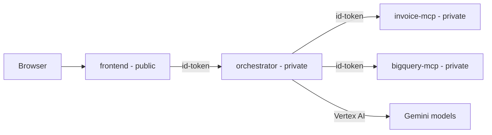

# GCP Setup & Deployment Guide — MCP Platform

This document consolidates everything needed to stand up the four independent
Cloud Run services in a new GCP project:

| Service | Folder | Cloud Run access | Talks to |
|---------|--------|------------------|----------|
| Frontend UI (BFF) | `frontend/` | public (`--allow-unauthenticated`) | orchestrator |
| Orchestrator backend | `orchestrator/` | private | both MCP servers + Vertex AI |
| Invoice MCP | `invoice-mcp/` | private | Google Cloud Storage |
| BigQuery MCP | `bigquery-mcp/` | private | BigQuery |



Set these shell variables first and reuse them throughout:

```powershell
$PROJECT = "your-project-id"
$REGION  = "us-central1"
$REPO    = "mcp-servers"
```

---

## Part 1 — Where to change project-specific values

### A. Values you edit in files

| File | Line / key | Current value | Change to |
|------|-----------|---------------|-----------|
| `.vscode/mcp.json` | `BIGQUERY_PROJECT` | `gcp-eds-finance-user-dev` | your project *(local dev only)* |
| `.vscode/mcp.json` | `GOOGLE_APPLICATION_CREDENTIALS` | local key path | your local key path *(local dev only)* |
| `invoice-mcp/cloudbuild.yaml` | `_GCS_BUCKET` default | `gcp-eds-finance-user-dev_isps_test_config_s` | **your knowledge bucket** ⚠️ see note |
| `orchestrator/cloudbuild.yaml` | `_VERTEX_LOCATION` | `us-central1` | your Vertex region |
| `orchestrator/cloudbuild.yaml` | `_INVOICE_URL`, `_BIGQUERY_URL` | empty | MCP URLs (after step 2) |
| `frontend/cloudbuild.yaml` | `_ORCHESTRATOR_URL` | empty | orchestrator URL (after step 3) |

> ⚠️ **Bucket discrepancy to resolve:** the deploy config defaults to
> `..._isps_test_config_s`, but the bucket that actually held the invoice data
> in testing was `invoice_knowledge_source` (also the default in
> `invoice-mcp/container.py`). Confirm which bucket holds the knowledge docs and
> use it consistently in `_GCS_BUCKET` **and** the storage IAM binding below.

### B. Values passed at deploy time (no file edit)

`$PROJECT_ID` is auto-injected by Cloud Build, so all `cloudbuild.yaml` files
already set `GCP_PROJECT=$PROJECT_ID` / `BIGQUERY_PROJECT=$PROJECT_ID`. Nothing
to hardcode.

- **Models** (optional): `_ROUTER_MODEL`, `_MODEL_SIMPLE/MODERATE/COMPLEX` in
  `orchestrator/cloudbuild.yaml`.
- **BigQuery tuning** (optional): `BIGQUERY_LOCATION`,
  `BIGQUERY_MAX_QUERY_RESULT_ROWS`, etc. are read from env by
  `bigquery-mcp/tools.yaml` — add them as `--set-env-vars` if needed.

---

## Part 2 — Service accounts to create

One dedicated least-privilege runtime SA per service.

```powershell
gcloud config set project $PROJECT

gcloud iam service-accounts create sa-invoice-mcp   --display-name "invoice-mcp runtime"
gcloud iam service-accounts create sa-bigquery-mcp  --display-name "bigquery-mcp runtime"
gcloud iam service-accounts create sa-orchestrator  --display-name "orchestrator runtime"
gcloud iam service-accounts create sa-frontend      --display-name "frontend runtime"
```

| SA | Used by | Email |
|----|---------|-------|
| `sa-invoice-mcp` | invoice-mcp | `sa-invoice-mcp@$PROJECT.iam.gserviceaccount.com` |
| `sa-bigquery-mcp` | bigquery-mcp | `sa-bigquery-mcp@$PROJECT.iam.gserviceaccount.com` |
| `sa-orchestrator` | orchestrator | `sa-orchestrator@$PROJECT.iam.gserviceaccount.com` |
| `sa-frontend` | frontend | `sa-frontend@$PROJECT.iam.gserviceaccount.com` |
| **Cloud Build SA** | all deploys | `$PROJECT_NUM@cloudbuild.gserviceaccount.com` (or `$PROJECT_NUM-compute@developer.gserviceaccount.com` on newer projects) |

---

## Part 3 — Permissions per service account

### APIs to enable (one-time)

```powershell
gcloud services enable `
  run.googleapis.com artifactregistry.googleapis.com cloudbuild.googleapis.com `
  aiplatform.googleapis.com bigquery.googleapis.com storage.googleapis.com
# Optional: only for bigquery-mcp's ask_data_insights (Conversational Analytics)
# gcloud services enable geminidataanalytics.googleapis.com
```

### 1. Cloud Build SA (the deployer)

```powershell
$PROJECT_NUM = gcloud projects describe $PROJECT --format="value(projectNumber)"
$BUILD_SA = "$PROJECT_NUM@cloudbuild.gserviceaccount.com"   # or the compute SA on newer projects

gcloud projects add-iam-policy-binding $PROJECT --member "serviceAccount:$BUILD_SA" --role roles/run.admin
gcloud projects add-iam-policy-binding $PROJECT --member "serviceAccount:$BUILD_SA" --role roles/artifactregistry.writer
gcloud projects add-iam-policy-binding $PROJECT --member "serviceAccount:$BUILD_SA" --role roles/iam.serviceAccountUser
```

`iam.serviceAccountUser` lets Cloud Build deploy services that *run as* your four
runtime SAs. Scope it to each runtime SA instead of project-wide for tighter
security.

### 2. `sa-invoice-mcp`

```powershell
# Read-only on the knowledge bucket (use the bucket confirmed in Part 1).
gcloud storage buckets add-iam-policy-binding gs://<YOUR_KNOWLEDGE_BUCKET> `
  --member "serviceAccount:sa-invoice-mcp@$PROJECT.iam.gserviceaccount.com" `
  --role roles/storage.objectViewer
```

> The DB/REST tools are still stubs, so no Cloud SQL / secret roles are needed
> yet. When implemented, add `roles/cloudsql.client` and
> `roles/secretmanager.secretAccessor`.

### 3. `sa-bigquery-mcp`

```powershell
$SA = "sa-bigquery-mcp@$PROJECT.iam.gserviceaccount.com"
gcloud projects add-iam-policy-binding $PROJECT --member "serviceAccount:$SA" --role roles/bigquery.jobUser
gcloud projects add-iam-policy-binding $PROJECT --member "serviceAccount:$SA" --role roles/bigquery.dataViewer
# Optional (only for ask_data_insights conversational analytics):
# --role roles/geminidataanalytics.dataAgentUser  and  roles/aiplatform.user
```

Tip: for least privilege, grant `bigquery.dataViewer` at the **dataset** level
instead of project-wide.

### 4. `sa-orchestrator`

```powershell
$SA = "sa-orchestrator@$PROJECT.iam.gserviceaccount.com"
# Call Vertex AI Gemini (fixes the 403 PERMISSION_DENIED seen without it).
gcloud projects add-iam-policy-binding $PROJECT --member "serviceAccount:$SA" --role roles/aiplatform.user
# Invoke the two private MCP services (service-level, not project-wide).
gcloud run services add-iam-policy-binding invoice-mcp  --region $REGION --member "serviceAccount:$SA" --role roles/run.invoker
gcloud run services add-iam-policy-binding bigquery-mcp --region $REGION --member "serviceAccount:$SA" --role roles/run.invoker
```

### 5. `sa-frontend`

```powershell
$SA = "sa-frontend@$PROJECT.iam.gserviceaccount.com"
gcloud run services add-iam-policy-binding orchestrator --region $REGION --member "serviceAccount:$SA" --role roles/run.invoker
```

### Permissions summary

| SA | Role | Scope | Why |
|----|------|-------|-----|
| Cloud Build | `run.admin`, `artifactregistry.writer`, `iam.serviceAccountUser` | project | build + deploy |
| sa-invoice-mcp | `storage.objectViewer` | bucket | read knowledge docs |
| sa-bigquery-mcp | `bigquery.jobUser` + `bigquery.dataViewer` | project/dataset | run queries + read data |
| sa-orchestrator | `aiplatform.user` | project | Gemini via Vertex |
| sa-orchestrator | `run.invoker` | invoice-mcp, bigquery-mcp | call private MCPs |
| sa-frontend | `run.invoker` | orchestrator | call private backend |

---

## Part 4 — Deploy order

The `cloudbuild.yaml` files do not currently set `--service-account`, so runtime
defaults to the Compute SA. To use the dedicated SAs above, add one line to each
`deploy` step's args, e.g. in `invoice-mcp/cloudbuild.yaml`:

```yaml
      - --service-account=sa-invoice-mcp@$PROJECT_ID.iam.gserviceaccount.com
```

(and the analogous SA for each of the other three services).

Then deploy in dependency order:

1. **Artifact Registry** (once):
   ```powershell
   gcloud artifacts repositories create $REPO --repository-format=docker --location=$REGION
   ```
2. **invoice-mcp** & **bigquery-mcp**:
   ```powershell
   gcloud builds submit . --config invoice-mcp/cloudbuild.yaml `
     --substitutions=_REGION=$REGION,_REPO=$REPO,_GCS_BUCKET=<YOUR_KNOWLEDGE_BUCKET>
   gcloud builds submit . --config bigquery-mcp/cloudbuild.yaml `
     --substitutions=_REGION=$REGION,_REPO=$REPO
   ```
   Note their URLs and append `/mcp`:
   ```powershell
   $INVOICE_URL  = (gcloud run services describe invoice-mcp  --region $REGION --format "value(status.url)") + "/mcp"
   $BIGQUERY_URL = (gcloud run services describe bigquery-mcp --region $REGION --format "value(status.url)") + "/mcp"
   ```
3. **orchestrator** (pass the MCP URLs from step 2):
   ```powershell
   gcloud builds submit . --config orchestrator/cloudbuild.yaml `
     --substitutions=_REGION=$REGION,_REPO=$REPO,_VERTEX_LOCATION=$REGION,_INVOICE_URL=$INVOICE_URL,_BIGQUERY_URL=$BIGQUERY_URL
   $ORCH_URL = gcloud run services describe orchestrator --region $REGION --format "value(status.url)"
   ```
4. **frontend** (pass the orchestrator URL from step 3):
   ```powershell
   gcloud builds submit ./frontend --config frontend/cloudbuild.yaml `
     --substitutions=_REGION=$REGION,_REPO=$REPO,_ORCHESTRATOR_URL=$ORCH_URL
   ```

Open the frontend URL in a browser:

```powershell
gcloud run services describe mcp-frontend --region $REGION --format "value(status.url)"
```

---

## Known limitations

- **invoice-mcp DB/REST tools are stubs** (`find_invoice`, `shipment_status`,
  `invoice_summary`, `download_invoice` raise `NotImplementedError`). Only the
  `knowledge_*` (GCS) tools return data today.
- **`ask_data_insights`** (BigQuery conversational analytics) may require the
  Conversational Analytics API and extra roles — enable/grant only if used.
