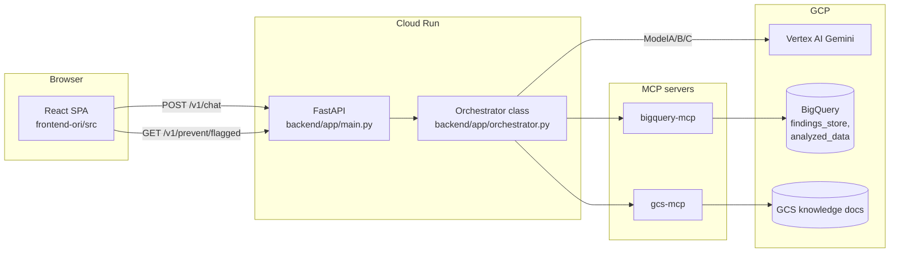
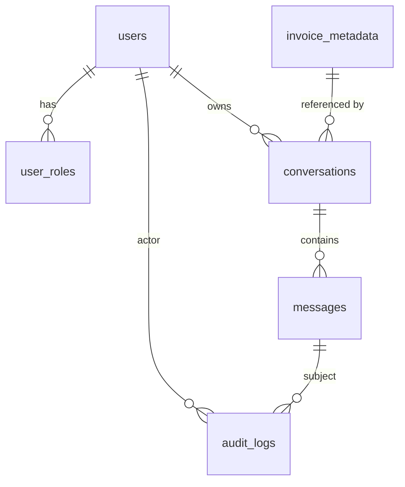

# OneInvoice — Role-Based Auth, Mandatory Invoice Context, Traceability, Chat History & Multi-Session
## Principal Architect Implementation & Code-Change Plan

> Every statement below is derived from the actual codebase. Exact files, classes and functions are referenced inline. Nothing is assumed.

---

## 1. Current Architecture Analysis

### 1.1 Physical topology (from the repo)

The backend of record is [backend/app](hackathon-codebase/backend/app) — the FastAPI app the frontend actually calls. All changes in this plan target it.

| Service | Path | Role | Used by `frontend-ori`? |
|---|---|---|---|
| Invoice-Processing SaaS API | [backend/app](hackathon-codebase/backend/app) | FastAPI app the UI actually calls (`/v1/chat`, `/v1/prevent/*`) | **Yes** |
| BigQuery MCP | [bigquery-mcp](hackathon-codebase/bigquery-mcp) | `tools.yaml` MCP server over BigQuery | Indirectly (via backend MCP client) |
| GCS MCP | [gcs-mcp](hackathon-codebase/gcs-mcp) | Knowledge/document MCP server | Indirectly |
| Shared libs | [shared](hackathon-codebase/shared) | auth stubs, models, connectors | Partially |
| Frontend | [frontend-ori/src](hackathon-codebase/frontend-ori/src) | React 18 + Vite + Tailwind + framer-motion | — |

**This plan targets the live path: `frontend-ori` → `backend/app`.**



### 1.2 Frontend architecture

- **Router**: [App.jsx](hackathon-codebase/frontend-ori/src/App.jsx) — routes `/login`, `/` (Home), `/agent/:slug`. `RequireAuth` gates protected routes via `isAuthenticated()`.
- **Auth**: `isAuthenticated()` in [App.jsx](hackathon-codebase/frontend-ori/src/App.jsx#L13) reads `localStorage.getItem('ii_user')`. [Login.jsx](hackathon-codebase/frontend-ori/src/pages/Login.jsx) `onSubmit()` writes `{ userId, at }` to `localStorage` — **no server call, no password check, no role**.
- **Agent registry**: [agents.js](hackathon-codebase/frontend-ori/src/data/agents.js) — static array of all 4 agents (`explain`, `resolve`, `simulate`, `prevent`); `getAgent(slug)` lookup. **No role filtering anywhere.**
- **Chat surface**: [ChatPanel.jsx](hackathon-codebase/frontend-ori/src/components/chat/ChatPanel.jsx) — holds `sessions` in React state via `makeSession()`; multi-session UI exists visually (`newChat()`, sidebar `sessions.map`) but is **ephemeral (lost on refresh)**. Invoice fields already exist: `invoiceNumber`/`invoiceDate` state, and `send()` already blocks on `if (!invoiceNumber.trim()) return`.
- **API client**: [api.js](hackathon-codebase/frontend-ori/src/lib/api.js) — `sendChatMessage()`, `getFlaggedInvoices()`, `reviewFlaggedInvoice()`. Sends `invoice_number` only when present; **sends no auth header and no user identity**.

### 1.3 Backend architecture

- **HTTP surface**: [main.py](hackathon-codebase/backend/app/main.py) — 14 endpoints, `CORSMiddleware` with `allow_credentials=False`. **No authentication dependency on any route.**
- **Orchestrator**: [orchestrator.py](hackathon-codebase/backend/app/orchestrator.py) `Orchestrator._execute()` — the 10-stage pipeline (`load_context → sanitize_input → route_model_a → ground_fetch_b → sanitize_mcp → analyze_model_c → output_guardrails → sanitize_output → human_review → feedback`).
- **Chat adapter**: [chat_adapter.py](hackathon-codebase/backend/app/chat_adapter.py) `run_chat()` — maps agent slug→verb, `_extract_invoice()` regex, `_invoice_from_history()`, then calls `orch.run_direct()` / `orch.run()`. Flattens structured output to a single `reply` string in `_format_output()` (**this is where evidence is currently discarded**).
- **LLM roles**: [agents.py](hackathon-codebase/backend/app/agents.py) — `ModelA.route()` (intent + complexity + data_source, an **LLM call** via `invoke_llm`), `ModelB` (grounding), `ModelC` (drafting).
- **Grounding/data**: [gcp.py](hackathon-codebase/backend/app/gcp.py) `GCPClients.load_finding_context()` — currently a **placeholder** returning `loaded: False`; real invoice lookup is a `TODO`. `_findings` is an in-memory dict standing in for BigQuery.
- **Pause/resume state**: [store.py](hackathon-codebase/backend/app/store.py) — `_STORE: dict` in-memory (`put/get/pop`). Marked TODO to move to Firestore/Redis.
- **Auth primitives (unused)**: [authenticator.py](hackathon-codebase/shared/auth/authenticator.py) — `Authenticator` ABC, `NoOpAuthenticator`, `StaticTokenAuthenticator`. Not imported by `backend/app`.

### 1.4 Existing user journey

1. User opens SPA → `RequireAuth` redirects to `/login`.
2. User types any `userId`/`password` → [Login.jsx](hackathon-codebase/frontend-ori/src/pages/Login.jsx) writes `ii_user` → navigates `/`.
3. Home shows **all 4** agent cards ([agents.js](hackathon-codebase/frontend-ori/src/data/agents.js)).
4. User opens `/agent/:slug` → [ChatPanel.jsx](hackathon-codebase/frontend-ori/src/components/chat/ChatPanel.jsx). Enters invoice number (required client-side) + optional date + question.
5. `send()` concatenates `Invoice X · Date Y — question` into one string → `sendChatMessage()` → `POST /v1/chat`.
6. Backend `run_chat()` re-parses the invoice from text with `_extract_invoice()`, then `ModelA.route()` (**LLM call**) infers verb & data source.
7. Pipeline runs; `reply` string returned. Evidence/citations are computed inside `ExplainOutput.citations` / `ResolveOutput.evidence` but **flattened away** before the UI sees them.
8. Chat lives only in React state; refresh loses everything.

### 1.5 Current API inventory (live backend)

| Method | Path | Handler | Auth |
|---|---|---|---|
| GET | `/health` | `health` | none |
| POST | `/v1/process` | `process` | none |
| POST | `/v1/chat` | `chat` → `run_chat` | none |
| POST | `/v1/agents/run` | `agents_run` | none |
| POST | `/v1/agents/from-finding/{id}` | `agents_from_finding` | none |
| POST | `/v1/clarify/{trace_id}` | `clarify` | none |
| POST | `/v1/review/{trace_id}` | `review` | none |
| GET | `/v1/cs/queue` | `cs_queue` | none |
| POST | `/v1/prevent/pubsub` | `prevent_pubsub` | none |
| GET | `/v1/prevent/findings` | `prevent_findings` | none |
| POST | `/v1/prevent/findings/{id}/process` | `prevent_process_finding` | none |
| GET | `/v1/prevent/flagged` | `prevent_flagged` | none |
| POST | `/v1/prevent/flagged/{id}/review` | `prevent_review_flagged` | none |
| POST | `/v1/feedback` | `feedback` | none |

### 1.6 Current data entities

- **In-code models** ([schemas.py](hackathon-codebase/backend/app/schemas.py)): `UserContext` (`user_id`, `roles: list[str]`, `contract_ids`, `geo`, `currency`), `ChatTurn`, `ProcessRequest`, `ChatRequest`/`ChatResponse`, `PreventFinding`, `FlaggedInvoice`, `Citation`, `Evidence`, per-verb outputs.
- **BigQuery (POC in-memory)**: `findings_store`, `analyzed_data` ([config.py](hackathon-codebase/backend/app/config.py) `bigquery_findings_table`, `bigquery_analyzed_table`), backed by `GCPClients._findings` dict.
- **Sample CSVs** ([sample_data](hackathon-codebase/sample_data)): `invoice_records.csv`, `shipment_transactions.csv`, `contract_master.csv`, `findings_store.csv`, etc. — these define the real invoice relationship graph.
- **No** `users`, `conversations`, `messages`, `audit_logs`, `user_roles`, `invoice_metadata` tables exist.

### 1.7 Current agent workflow

`ModelA` selects verb (`EXPLAIN`/`RESOLVE`/`SIMULATE`; `PREVENT` is event-driven). `ACTIONABLE_VERBS = {RESOLVE}` → requires CS human review via `CSQueueService`. `INTERACTIVE_VERBS = {EXPLAIN, RESOLVE, SIMULATE}`. The `Channel` enum already separates `CS` vs `CUSTOMER_PORTAL`, and `_execute()` already **refuses actionable Resolve output on the customer portal** — but nothing today sets `channel` from a real role.

### 1.8 Frontend↔backend coupling

- Contract is loose JSON; the only true coupling is field names in `sendChatMessage()` ([api.js](hackathon-codebase/frontend-ori/src/lib/api.js)) ↔ `ChatRequest` ([schemas.py](hackathon-codebase/backend/app/schemas.py)).
- `channel` and `user` are optional in `ChatRequest`; the UI sends neither, so backend defaults to `UserContext(user_id="demo-user", roles=["cs"])` in `run_chat()` — **effectively everyone is CS today.**

---

## 2. Gap Analysis

| # | Requirement | Current state | Gap |
|---|---|---|---|
| R1 | Role-based login | Fake localStorage login, all agents visible, backend defaults everyone to `roles=["cs"]` | No user store, no password verification, no JWT, no role claim, no agent gating, no authz middleware |
| R2 | Mandatory invoice, no LLM discovery | `invoice_number` optional; `_extract_invoice()` + `ModelA.route()` infer it via LLM; `load_finding_context()` is a placeholder | Make invoice mandatory end-to-end; validate existence; fetch relationships; bypass discovery LLM step |
| R3 | Response traceability | `Citation`/`Evidence` computed then flattened in `_format_output()` | Surface structured evidence through `ChatResponse`; new UI; API contract |
| R4 | Chat history persistence | React-state only, lost on refresh; `store.py` in-memory | Durable BigQuery tables + CRUD APIs + history UI + access control |
| R5 | Multi-session | Visual sessions in `ChatPanel` state only | Persistent `conversations` + `messages` + audit; DDL |

---

## 3. Target Architecture

```mermaid
flowchart TB
  subgraph Browser
    LOGIN[Login.jsx]
    AUTHCTX[AuthContext<br/>token+role]
    HOME[Home role-filtered agents]
    CHAT[ChatPanel<br/>invoice-gated + evidence panel + history]
  end
  subgraph API[backend/app FastAPI]
    AUTH[/v1/auth/* login,me/]
    MW[auth.py deps<br/>require_user / require_support]
    CHATEP[/v1/chat/]
    CONV[/v1/conversations/*/]
    INV[/v1/invoices/{no}/context/]
  end
  subgraph Data[BigQuery dataset]
    U[(users)]
    UR[(user_roles)]
    C[(conversations)]
    M[(messages)]
    IM[(invoice_metadata)]
    AL[(audit_logs)]
  end
  LOGIN --> AUTH --> U & UR
  AUTHCTX --> MW
  HOME -->|role from JWT| CHAT
  CHAT --> CHATEP --> MW
  CHATEP --> INV --> IM
  CHATEP --> C & M & AL
  CONV --> C & M
```

Design principles applied to the existing code:
- **Reuse** the `Authenticator` abstraction ([authenticator.py](hackathon-codebase/shared/auth/authenticator.py)) — add a `JWTAuthenticator` implementation rather than a new pattern.
- **Reuse** `UserContext.roles` + `Channel` — role `CUSTOMER` → `Channel.CUSTOMER_PORTAL`, `CUSTOMER_SUPPORT` → `Channel.CS`. The refusal logic in `_execute()` already enforces the portal restriction, so role→channel mapping instantly gates Resolve actioning.
- **Reuse** `Citation`/`Evidence` models — stop discarding them in `_format_output()`.
- **Replace** invoice discovery: new `/v1/invoices/{no}/context` populated from `invoice_metadata`, injected as `context` into `_execute()`, skipping the `_extract_invoice`/router inference.

---

## 4. API Design (OpenAPI-style contracts)

All new endpoints live in `backend/app`. New request/response models go in [schemas.py](hackathon-codebase/backend/app/schemas.py). Auth dependencies in a new `backend/app/auth.py`.

### 4.1 Auth APIs

```yaml
POST /v1/auth/login:
  request:
    application/json:
      username: string   # required
      password: string   # required
  responses:
    200:
      access_token: string      # JWT, HS256
      token_type: "bearer"
      expires_in: 3600
      user:
        user_id: string
        username: string
        display_name: string
        role: "CUSTOMER" | "CUSTOMER_SUPPORT"
        contract_ids: [string]
    401: { detail: "Invalid username or password." }

GET /v1/auth/me:
  security: [bearerAuth]
  responses:
    200:
      user_id: string
      username: string
      display_name: string
      role: "CUSTOMER" | "CUSTOMER_SUPPORT"
      contract_ids: [string]
      allowed_agents: ["explain","resolve","simulate", "prevent"?]  # prevent only for support
    401: { detail: "Not authenticated." }

POST /v1/auth/logout:      # stateless; client drops token. Optional server-side jti denylist.
  security: [bearerAuth]
  responses: { 204: {} }
```

### 4.2 Invoice APIs (replaces LLM discovery)

```yaml
GET /v1/invoices/{invoice_number}/context:
  security: [bearerAuth]
  parameters:
    - invoice_number: path, required
    - as_of_date: query, optional (YYYY-MM-DD)
  responses:
    200:
      invoice_number: string
      exists: true
      invoice_date: date
      customer_id: string
      contract_number: string
      shipment_ids: [string]
      status: string
      currency: string
      total_amount: number
      relationships:            # pre-joined graph, one round trip
        shipments: [ {...} ]
        contract: { ... }
        surcharges: [ {...} ]
        disputes: [ {...} ]
      source_system: "BigQuery"
      last_updated: datetime
    403: { detail: "Invoice not in your contract scope." }   # row-level security
    404: { detail: "Invoice INV0001 not found." }
```

### 4.3 Chat API (extended)

`ChatRequest` gains **mandatory** `invoice_number`, plus `conversation_id` and derives `channel`/`user` from the JWT (no longer client-trusted).

```yaml
POST /v1/chat:
  security: [bearerAuth]
  request:
    agent: "explain"|"resolve"|"simulate"|"prevent"
    message: string                 # required
    invoice_number: string          # NOW REQUIRED
    as_of_date: date                # optional
    conversation_id: string         # optional; created if absent
    trace_id: string                # optional (resume clarification)
    scenario_params: object
  responses:
    200:
      trace_id: string
      conversation_id: string
      message_id: string
      status: "completed"|"clarification_needed"|"awaiting_human_review"|"refused"|"error"
      verb: string|null
      reply: string
      evidence: [EvidenceItem]      # NEW — structured attribution (R3)
      requires_human_review: bool
      created_at: datetime
    403: { detail: "Agent 'prevent' not available for your role." }
    422: { detail: "invoice_number is required." }

EvidenceItem:
  source_object: string     # e.g. "Invoice_Status"
  record_id: string         # e.g. "IS-100921"
  retrieved_fields: [string]
  confidence: number        # 0..100
  last_updated: datetime
  source_system: string     # "SAP" | "BigQuery" | "GCS"
  snippet: string
  locator: string           # uri / row key / page#section
```

### 4.4 Conversation / History / Delete APIs

```yaml
GET /v1/conversations:
  security: [bearerAuth]
  parameters:
    - q: query, optional              # full-text search across title/messages
    - agent: query, optional
    - invoice_number: query, optional
    - limit: query, default 50
    - cursor: query, optional
  responses:
    200:
      items: [ { conversation_id, title, agent, invoice_number, updated_at, message_count } ]
      next_cursor: string|null

POST /v1/conversations:
  security: [bearerAuth]
  request: { agent: string, invoice_number: string, title?: string }
  responses: { 201: { conversation_id, ... } }

GET /v1/conversations/{conversation_id}:      # reload full thread
  security: [bearerAuth]
  responses:
    200:
      conversation_id, title, agent, invoice_number, created_at
      messages: [ { message_id, role, question?, response?, evidence?, created_at } ]
    403: { detail: "Not your conversation." }   # ownership check
    404: {}

DELETE /v1/conversations/{conversation_id}:     # soft delete
  security: [bearerAuth]
  responses: { 204: {} }

DELETE /v1/conversations:                        # delete all for the user
  security: [bearerAuth]
  responses: { 200: { deleted: integer } }
```

### 4.5 Role API

```yaml
GET /v1/roles/agents:      # returns the agent list the caller may use (drives UI gating)
  security: [bearerAuth]
  responses:
    200: { role: string, allowed_agents: [string] }
```

Authorization rules (enforced server-side, not just UI):
- `require_user` — valid JWT required on every `/v1/*` except `/health`, `/v1/auth/login`.
- `require_support` — role == `CUSTOMER_SUPPORT`; guards `prevent` agent, `/v1/prevent/*`, `/v1/cs/queue`, `/v1/review/*`.
- Agent allow-list check inside `chat()` before dispatch.

---

## 5. Database Design

Six tables in the existing BigQuery dataset ([config.py](hackathon-codebase/backend/app/config.py) `bigquery_dataset`). Rationale per table:

| Table | Primary id | Partition | Cluster | Why |
|---|---|---|---|---|
| `users` | `user_id` (STRING UUID) | `DATE(created_at)` | `username` | Low volume; cluster on `username` because login queries by it. Partition keeps historical growth cheap to prune. |
| `user_roles` | (`user_id`,`role`) | none (tiny) | `role` | Separate table supports future multi-role; cluster on `role` for "all support users" scans. |
| `conversations` | `conversation_id` (UUID) | `DATE(created_at)` | `user_id`, `invoice_number` | History list filters by `user_id`; per-invoice lookups cluster well. Time-partition prunes old chats. |
| `messages` | `message_id` (UUID) | `DATE(created_at)` | `conversation_id` | Reload-thread queries filter by `conversation_id`; clustering gives block-local reads. Partition bounds cost on large chat volume. |
| `invoice_metadata` | `invoice_number` | `invoice_date` (DATE) | `customer_id`, `contract_number` | Invoice-context lookups are point queries by `invoice_number` + scope filter by `customer_id`; clustering both accelerates row-level security. |
| `audit_logs` | `audit_id` (UUID) | `DATE(event_time)` | `actor_user_id`, `action` | Append-only; partition by day (retention/BI), cluster by actor+action for security forensics. |

> BigQuery has no enforced PKs/FKs; "primary id" = the logical key used in all `WHERE`/joins and enforced in application code. Partitioning caps bytes scanned (cost) and clustering co-locates rows for the dominant filter, exactly matching each table's read pattern above.

Entity relationships:



---

## 6. BigQuery DDL

```sql
-- Dataset assumed: `${PROJECT}.${DATASET}` (see config.py bigquery_project/bigquery_dataset)

-- 1. users -----------------------------------------------------------------
CREATE TABLE IF NOT EXISTS `${PROJECT}.${DATASET}.users` (
  user_id        STRING NOT NULL,          -- UUIDv4, logical PK
  username       STRING NOT NULL,          -- login handle, unique (enforced in app)
  display_name   STRING,
  email          STRING,
  password_hash  STRING NOT NULL,          -- bcrypt; NEVER store plaintext
  primary_role   STRING NOT NULL,          -- 'CUSTOMER' | 'CUSTOMER_SUPPORT'
  contract_ids   ARRAY<STRING>,            -- row-level security scope
  geo            STRING,
  currency       STRING,
  is_active      BOOL NOT NULL,
  created_at     TIMESTAMP NOT NULL,
  updated_at     TIMESTAMP
)
PARTITION BY DATE(created_at)
CLUSTER BY username
OPTIONS (description = 'Application users with hashed credentials and RLS scope.');

-- 2. user_roles ------------------------------------------------------------
CREATE TABLE IF NOT EXISTS `${PROJECT}.${DATASET}.user_roles` (
  user_id     STRING NOT NULL,
  role        STRING NOT NULL,             -- 'CUSTOMER' | 'CUSTOMER_SUPPORT'
  granted_by  STRING,
  granted_at  TIMESTAMP NOT NULL
)
CLUSTER BY role
OPTIONS (description = 'Role grants; supports future multi-role per user.');

-- 3. conversations ---------------------------------------------------------
CREATE TABLE IF NOT EXISTS `${PROJECT}.${DATASET}.conversations` (
  conversation_id STRING NOT NULL,         -- UUIDv4, logical PK
  user_id         STRING NOT NULL,
  agent           STRING NOT NULL,         -- explain|resolve|simulate|prevent
  invoice_number  STRING NOT NULL,
  as_of_date      DATE,
  title           STRING,
  message_count   INT64 NOT NULL,
  is_deleted      BOOL NOT NULL,           -- soft delete
  created_at      TIMESTAMP NOT NULL,
  updated_at      TIMESTAMP NOT NULL
)
PARTITION BY DATE(created_at)
CLUSTER BY user_id, invoice_number
OPTIONS (description = 'Per-user multi-session conversations bound to an invoice + agent.');

-- 4. messages --------------------------------------------------------------
CREATE TABLE IF NOT EXISTS `${PROJECT}.${DATASET}.messages` (
  message_id      STRING NOT NULL,         -- UUIDv4, logical PK
  conversation_id STRING NOT NULL,
  user_id         STRING NOT NULL,
  invoice_number  STRING NOT NULL,
  agent           STRING NOT NULL,
  role            STRING NOT NULL,         -- 'user' | 'assistant'
  question        STRING,                  -- populated for user turns
  response        STRING,                  -- populated for assistant turns
  evidence        JSON,                    -- array of EvidenceItem (R3)
  trace_id        STRING,
  status          STRING,                  -- pipeline status
  created_at      TIMESTAMP NOT NULL
)
PARTITION BY DATE(created_at)
CLUSTER BY conversation_id
OPTIONS (description = 'Individual chat turns with structured evidence attribution.');

-- 5. invoice_metadata ------------------------------------------------------
CREATE TABLE IF NOT EXISTS `${PROJECT}.${DATASET}.invoice_metadata` (
  invoice_number  STRING NOT NULL,         -- logical PK
  invoice_date    DATE,
  customer_id     STRING NOT NULL,
  contract_number STRING,
  shipment_ids    ARRAY<STRING>,
  status          STRING,                  -- e.g. BLOCKED, OPEN, PAID
  dispute_reason  STRING,
  currency        STRING,
  total_amount    NUMERIC,
  source_system   STRING,                  -- 'SAP' | 'BigQuery'
  last_updated    TIMESTAMP NOT NULL
)
PARTITION BY invoice_date
CLUSTER BY customer_id, contract_number
OPTIONS (description = 'Denormalised invoice context to eliminate LLM-based discovery.');

-- 6. audit_logs ------------------------------------------------------------
CREATE TABLE IF NOT EXISTS `${PROJECT}.${DATASET}.audit_logs` (
  audit_id       STRING NOT NULL,          -- UUIDv4, logical PK
  actor_user_id  STRING NOT NULL,
  actor_role     STRING,
  action         STRING NOT NULL,          -- LOGIN, CHAT, DELETE_CONVERSATION, REVIEW, ...
  subject_type   STRING,                   -- conversation|message|invoice|finding
  subject_id     STRING,
  invoice_number STRING,
  ip_address     STRING,
  detail         JSON,
  event_time     TIMESTAMP NOT NULL
)
PARTITION BY DATE(event_time)
CLUSTER BY actor_user_id, action
OPTIONS (description = 'Append-only security & compliance audit trail.');
```

---

## 7. Sample Data

```sql
-- Users: 5 customers + 3 support. password_hash = bcrypt('Passw0rd!') placeholder.
INSERT INTO `${PROJECT}.${DATASET}.users`
(user_id, username, display_name, email, password_hash, primary_role, contract_ids, geo, currency, is_active, created_at, updated_at) VALUES
('u-cust-001','acme',      'Acme Corp',        'ap@acme.com',      '$2b$12$Q9k7Xr3m0m3n1c1u9y0lNe','CUSTOMER',        ['CTR-1001'],           'US','USD', TRUE, TIMESTAMP '2025-01-05 09:00:00', CURRENT_TIMESTAMP()),
('u-cust-002','globex',    'Globex Ltd',       'billing@globex.io','$2b$12$Q9k7Xr3m0m3n1c1u9y0lNe','CUSTOMER',        ['CTR-1002','CTR-1006'],'IN','INR', TRUE, TIMESTAMP '2025-01-06 09:00:00', CURRENT_TIMESTAMP()),
('u-cust-003','initech',   'Initech',          'ap@initech.com',   '$2b$12$Q9k7Xr3m0m3n1c1u9y0lNe','CUSTOMER',        ['CTR-1003'],           'US','USD', TRUE, TIMESTAMP '2025-01-06 10:00:00', CURRENT_TIMESTAMP()),
('u-cust-004','umbrella',  'Umbrella Co',      'finance@umbrella.com','$2b$12$Q9k7Xr3m0m3n1c1u9y0lNe','CUSTOMER',     ['CTR-1004'],           'DE','EUR', TRUE, TIMESTAMP '2025-01-07 11:00:00', CURRENT_TIMESTAMP()),
('u-cust-005','hooli',     'Hooli Inc',        'ap@hooli.com',     '$2b$12$Q9k7Xr3m0m3n1c1u9y0lNe','CUSTOMER',        ['CTR-1005'],           'US','USD', TRUE, TIMESTAMP '2025-01-08 08:30:00', CURRENT_TIMESTAMP()),
('u-sup-001', 'ssmith',    'Sarah Smith (CS)', 'sarah@oneinvoice.com','$2b$12$Q9k7Xr3m0m3n1c1u9y0lNe','CUSTOMER_SUPPORT', [], 'US','USD', TRUE, TIMESTAMP '2025-01-02 08:00:00', CURRENT_TIMESTAMP()),
('u-sup-002', 'rkumar',    'Rahul Kumar (CS)', 'rahul@oneinvoice.com','$2b$12$Q9k7Xr3m0m3n1c1u9y0lNe','CUSTOMER_SUPPORT', [], 'IN','INR', TRUE, TIMESTAMP '2025-01-02 08:05:00', CURRENT_TIMESTAMP()),
('u-sup-003', 'mgarcia',   'Maria Garcia (CS)','maria@oneinvoice.com','$2b$12$Q9k7Xr3m0m3n1c1u9y0lNe','CUSTOMER_SUPPORT', [], 'DE','EUR', TRUE, TIMESTAMP '2025-01-02 08:10:00', CURRENT_TIMESTAMP());

INSERT INTO `${PROJECT}.${DATASET}.user_roles` (user_id, role, granted_by, granted_at) VALUES
('u-cust-001','CUSTOMER','system',TIMESTAMP '2025-01-05 09:00:00'),
('u-cust-002','CUSTOMER','system',TIMESTAMP '2025-01-06 09:00:00'),
('u-cust-003','CUSTOMER','system',TIMESTAMP '2025-01-06 10:00:00'),
('u-cust-004','CUSTOMER','system',TIMESTAMP '2025-01-07 11:00:00'),
('u-cust-005','CUSTOMER','system',TIMESTAMP '2025-01-08 08:30:00'),
('u-sup-001','CUSTOMER_SUPPORT','system',TIMESTAMP '2025-01-02 08:00:00'),
('u-sup-002','CUSTOMER_SUPPORT','system',TIMESTAMP '2025-01-02 08:05:00'),
('u-sup-003','CUSTOMER_SUPPORT','system',TIMESTAMP '2025-01-02 08:10:00');

-- Invoice metadata aligned with sample_data/invoice_records.csv identifiers.
INSERT INTO `${PROJECT}.${DATASET}.invoice_metadata`
(invoice_number, invoice_date, customer_id, contract_number, shipment_ids, status, dispute_reason, currency, total_amount, source_system, last_updated) VALUES
('INV0001', DATE '2025-07-01','u-cust-001','CTR-1001',['SHP0001'],           'OPEN',   NULL,               'USD', 1204.50,'SAP',      TIMESTAMP '2025-08-01 00:00:00'),
('INV0004', DATE '2025-07-03','u-cust-001','CTR-1001',['SHP0004'],           'BLOCKED','payment dispute',  'USD',  980.00,'SAP',      TIMESTAMP '2025-08-01 00:00:00'),
('INV0011', DATE '2025-07-06','u-cust-002','CTR-1002',['SHP0011'],           'OPEN',   'missing discount', 'INR',72000.00,'BigQuery', TIMESTAMP '2025-08-02 00:00:00'),
('INV0018', DATE '2025-07-09','u-cust-003','CTR-1003',['SHP0018','SHP0019'], 'OPEN',   'weight dispute',   'USD', 3320.00,'SAP',      TIMESTAMP '2025-08-03 00:00:00'),
('INV0005', DATE '2025-07-04','u-cust-005','CTR-1005',['SHP0005'],           'PAID',   NULL,               'USD',  640.00,'BigQuery', TIMESTAMP '2025-08-01 00:00:00');

-- Conversations: multiple per user, multiple agents.
INSERT INTO `${PROJECT}.${DATASET}.conversations`
(conversation_id, user_id, agent, invoice_number, as_of_date, title, message_count, is_deleted, created_at, updated_at) VALUES
('cv-001','u-cust-001','explain', 'INV0001', DATE '2025-07-01','Break down INV0001 charges', 4, FALSE, TIMESTAMP '2025-08-10 10:00:00', TIMESTAMP '2025-08-10 10:05:00'),
('cv-002','u-cust-001','simulate','INV0001', DATE '2025-07-01','What if Road instead of Air', 2, FALSE, TIMESTAMP '2025-08-11 14:00:00', TIMESTAMP '2025-08-11 14:03:00'),
('cv-003','u-cust-002','resolve', 'INV0011', DATE '2025-07-06','Missing contracted discount', 2, FALSE, TIMESTAMP '2025-08-12 09:30:00', TIMESTAMP '2025-08-12 09:34:00'),
('cv-004','u-sup-001', 'prevent', 'INV0004', DATE '2025-07-03','Why was INV0004 flagged',    2, FALSE, TIMESTAMP '2025-08-12 11:00:00', TIMESTAMP '2025-08-12 11:02:00');

-- Messages (question/response pairs with evidence).
INSERT INTO `${PROJECT}.${DATASET}.messages`
(message_id, conversation_id, user_id, invoice_number, agent, role, question, response, evidence, trace_id, status, created_at) VALUES
('m-0001','cv-001','u-cust-001','INV0001','explain','user','Break down every charge on INV0001', NULL, NULL, 't-aaa', 'completed', TIMESTAMP '2025-08-10 10:00:00'),
('m-0002','cv-001','u-cust-001','INV0001','explain','assistant', NULL, 'INV0001 totals $1,204.50: base freight $980.00, fuel surcharge $148.50, residential fee $76.00.',
  JSON '[{"source_object":"invoice_records","record_id":"INV0001","retrieved_fields":["base_freight","fuel_surcharge","residential_fee","total"],"confidence":100,"last_updated":"2025-08-01T00:00:00Z","source_system":"SAP","snippet":"total=1204.50","locator":"bq://invoice_records/INV0001"}]',
  't-aaa','completed', TIMESTAMP '2025-08-10 10:00:04'),
('m-0003','cv-003','u-cust-002','INV0011','resolve','user','Should the missing contracted discount on INV0011 be credited?', NULL, NULL, 't-bbb','awaiting_human_review', TIMESTAMP '2025-08-12 09:30:00'),
('m-0004','cv-003','u-cust-002','INV0011','resolve','assistant', NULL, 'Contract CTR-1002 grants a 5% discount not applied. Recommend a credit of INR 3,600 (queued for CS approval).',
  JSON '[{"source_object":"contract_master","record_id":"CTR-1002","retrieved_fields":["discount_pct"],"confidence":97,"last_updated":"2025-08-02T00:00:00Z","source_system":"BigQuery","snippet":"discount_pct=5","locator":"bq://contract_master/CTR-1002"}]',
  't-bbb','awaiting_human_review', TIMESTAMP '2025-08-12 09:34:00'),
('m-0005','cv-004','u-sup-001','INV0004','prevent','user','Why was INV0004 flagged for surcharge not billed?', NULL, NULL, 't-ccc','completed', TIMESTAMP '2025-08-12 11:00:00'),
('m-0006','cv-004','u-sup-001','INV0004','prevent','assistant', NULL, 'Root cause: fuel surcharge index outdated; INV0004 is BLOCKED due to a payment dispute.',
  JSON '[{"source_object":"Invoice_Status","record_id":"IS-100921","retrieved_fields":["status","dispute_reason"],"confidence":100,"last_updated":"2025-08-01T00:00:00Z","source_system":"SAP","snippet":"status=BLOCKED; dispute_reason=payment dispute","locator":"sap://invoice_status/IS-100921"}]',
  't-ccc','completed', TIMESTAMP '2025-08-12 11:02:00');

INSERT INTO `${PROJECT}.${DATASET}.audit_logs`
(audit_id, actor_user_id, actor_role, action, subject_type, subject_id, invoice_number, ip_address, detail, event_time) VALUES
('a-0001','u-cust-001','CUSTOMER','LOGIN', NULL, NULL, NULL,'203.0.113.10', JSON '{"ua":"Chrome"}', TIMESTAMP '2025-08-10 09:59:00'),
('a-0002','u-cust-001','CUSTOMER','CHAT','message','m-0002','INV0001','203.0.113.10', JSON '{"agent":"explain"}', TIMESTAMP '2025-08-10 10:00:04'),
('a-0003','u-sup-001','CUSTOMER_SUPPORT','CHAT','message','m-0006','INV0004','198.51.100.7', JSON '{"agent":"prevent"}', TIMESTAMP '2025-08-12 11:02:00');
```

---

## 8. Frontend Changes

### 8.1 Screen-level
1. **Login** ([Login.jsx](hackathon-codebase/frontend-ori/src/pages/Login.jsx)): replace localStorage-only `onSubmit()` with a real `POST /v1/auth/login`; store `{ token, user }`; on error show `401` detail.
2. **Home** ([Home.jsx](hackathon-codebase/frontend-ori/src/pages/Home.jsx)): render agent cards filtered by `allowed_agents` from `AuthContext`.
3. **AgentPage** ([AgentPage.jsx](hackathon-codebase/frontend-ori/src/pages/AgentPage.jsx)): guard `prevent` slug — redirect `CUSTOMER` to `/`.
4. **ChatPanel** ([ChatPanel.jsx](hackathon-codebase/frontend-ori/src/components/chat/ChatPanel.jsx)): invoice field already mandatory client-side; wire real history (load/search/delete), persist sessions to `conversation_id`, and render an **Evidence panel** per assistant message.
5. **New: History view** — reuse the existing sidebar `sessions.map` list, backed by `GET /v1/conversations` with search box (already present: `issueQuery` pattern can be generalised).

### 8.2 Component-level
- **New `AuthContext`/`useAuth`** (in [hooks](hackathon-codebase/frontend-ori/src/hooks)): holds `{ token, user, allowedAgents }`, exposes `login()`, `logout()`, `authFetch()`.
- **[api.js](hackathon-codebase/frontend-ori/src/lib/api.js)**: add `Authorization: Bearer` to every request; add `login`, `getMe`, `getInvoiceContext`, `listConversations`, `getConversation`, `deleteConversation`, `deleteAllConversations`. Make `invoice_number` **always sent** and add `conversation_id`.
- **New `EvidencePanel.jsx`** in [components/chat](hackathon-codebase/frontend-ori/src/components/chat): renders `evidence[]` (see UX below).
- **[Message.jsx](hackathon-codebase/frontend-ori/src/components/chat/Message.jsx)**: accept optional `evidence` prop; show an "Evidence" affordance.

### 8.3 Routing (R1)
[App.jsx](hackathon-codebase/frontend-ori/src/App.jsx): `RequireAuth` reads token from `AuthContext` (not raw localStorage); add `RequireRole role="CUSTOMER_SUPPORT"` wrapper for `prevent` and CS-only routes.

```jsx
// App.jsx — role-aware guards
function RequireAuth({ children }) {
  const { token } = useAuth()
  return token ? children : <Navigate to="/login" replace />
}
function RequireRole({ role, children }) {
  const { user } = useAuth()
  if (!user) return <Navigate to="/login" replace />
  return user.role === role ? children : <Navigate to="/" replace />
}
```

### 8.4 State management
- Introduce `AuthContext` at the root (wrap in [main.jsx](hackathon-codebase/frontend-ori/src/main.jsx)).
- `ChatPanel` `sessions` state gains a `conversationId` field per session; `newChat()` calls `POST /v1/conversations`; `selectSession()` calls `GET /v1/conversations/{id}` to reload messages+evidence.

### 8.5 Validation logic (R2)
Invoice field: already blocks empty in `send()`. Add: on blur, call `getInvoiceContext(invoiceNumber)`; show inline error if `404`/`403`; disable send until `exists === true`. Date optional, validated as ISO if present.

### 8.6 Wireframe descriptions

**Login** — unchanged visual; on submit shows spinner then routes. Wrong creds → red helper under password.

**Home** — Customer sees 3 cards (Explain/Resolve/Simulate); Support sees 4 (adds Prevent). Filtering is `agents.filter(a => allowedAgents.includes(a.slug))`.

**Agent chat** — Above the prompt box (already scaffolded in `ChatPanel`):
```
┌───────────────────────────────────────────────┐
│ Invoice Number *  [ INV0001        ] ✓ valid   │
│ Invoice Date      [ 2025-07-01     ]           │
├───────────────────────────────────────────────┤
│ Question:         [ Enter your query… ]  [Send]│
└───────────────────────────────────────────────┘
```

**Evidence UX (R3) — recommended: Option C, Expandable proof panel.**
Rationale vs alternatives:
- *Option A citation cards* — good for many small sources, but clutters the transcript for enterprise multi-field evidence.
- *Option B evidence drawer* — global drawer loses the message↔evidence binding when scrolling long threads.
- **Option C (chosen)** — an inline collapsible "🔎 Evidence (n)" chip under each assistant bubble expands to a compact table (Source Object, Record ID, Fields, Confidence bar, Last Updated, Source System). Keeps attribution locally bound to its answer, low visual noise, scales to multi-source, and matches the existing expandable-card pattern already in `ChatPanel` (`expandedId`).

```
The invoice is currently blocked due to a payment dispute.
   🔎 Evidence (1)  ▸
   └─ expanded ─────────────────────────────────────────
      Source Object : Invoice_Status
      Record ID     : IS-100921
      Fields        : status, dispute_reason
      Confidence    : ██████████ 100%
      Last Updated  : 2025-08-01
      Source System : SAP
```

---

## 9. Backend Changes

### 9.1 New `backend/app/auth.py` (JWT + deps)
```python
# backend/app/auth.py
from datetime import datetime, timedelta, timezone
import jwt, bcrypt
from fastapi import Depends, HTTPException, status
from fastapi.security import HTTPBearer, HTTPAuthorizationCredentials
from .config import get_settings
from .schemas import UserContext, Channel

_bearer = HTTPBearer(auto_error=False)
ALLOWED_AGENTS = {
    "CUSTOMER": {"explain", "resolve", "simulate"},
    "CUSTOMER_SUPPORT": {"explain", "resolve", "simulate", "prevent"},
}

def hash_password(pw: str) -> str:
    return bcrypt.hashpw(pw.encode(), bcrypt.gensalt()).decode()

def verify_password(pw: str, hashed: str) -> bool:
    return bcrypt.checkpw(pw.encode(), hashed.encode())

def issue_token(user_id: str, role: str, contract_ids: list[str]) -> str:
    s = get_settings()
    now = datetime.now(timezone.utc)
    payload = {"sub": user_id, "role": role, "contract_ids": contract_ids,
               "iat": now, "exp": now + timedelta(seconds=s.jwt_ttl_seconds)}
    return jwt.encode(payload, s.jwt_secret, algorithm="HS256")

def require_user(cred: HTTPAuthorizationCredentials = Depends(_bearer)) -> UserContext:
    if cred is None:
        raise HTTPException(status.HTTP_401_UNAUTHORIZED, "Not authenticated.")
    try:
        claims = jwt.decode(cred.credentials, get_settings().jwt_secret, algorithms=["HS256"])
    except jwt.PyJWTError as exc:
        raise HTTPException(status.HTTP_401_UNAUTHORIZED, "Invalid or expired token.") from exc
    return UserContext(user_id=claims["sub"], roles=[claims["role"]],
                       contract_ids=claims.get("contract_ids", []))

def require_support(user: UserContext = Depends(require_user)) -> UserContext:
    if "CUSTOMER_SUPPORT" not in user.roles:
        raise HTTPException(status.HTTP_403_FORBIDDEN, "Support role required.")
    return user

def channel_for(user: UserContext) -> Channel:
    return Channel.CS if "CUSTOMER_SUPPORT" in user.roles else Channel.CUSTOMER_PORTAL
```

- **Config additions** ([config.py](hackathon-codebase/backend/app/config.py)): `jwt_secret: str`, `jwt_ttl_seconds: int = 3600`. Load from env/Secret Manager — never hardcode.
- **`requirements.txt`** ([backend/requirements.txt](hackathon-codebase/backend/requirements.txt)): add `pyjwt`, `bcrypt`.
- This reuses the intent of [authenticator.py](hackathon-codebase/shared/auth/authenticator.py) (implement the promised `GoogleOIDCAuthenticator` TODO as `JWTAuthenticator` if you prefer the ABC).

### 9.2 `main.py` wiring
- Set `allow_credentials=True` in `CORSMiddleware` and restrict `allow_origins` to the SPA origin (see Security).
- Add auth router endpoints and protect existing routes:

```python
# main.py additions
from .auth import require_user, require_support, channel_for, issue_token, verify_password
from .schemas import LoginRequest, LoginResponse, ChatRequest

@app.post("/v1/auth/login", response_model=LoginResponse)
async def login(body: LoginRequest, orch: Orchestrator = Depends(get_orchestrator)):
    user = await orch.gcp.get_user_by_username(body.username)     # new BQ read
    if user is None or not verify_password(body.password, user["password_hash"]):
        raise HTTPException(401, "Invalid username or password.")
    token = issue_token(user["user_id"], user["primary_role"], user.get("contract_ids", []))
    await orch.gcp.write_audit_log({"actor_user_id": user["user_id"],
        "actor_role": user["primary_role"], "action": "LOGIN"})
    return LoginResponse(access_token=token, user=_public_user(user))

@app.get("/v1/auth/me")
async def me(user=Depends(require_user)):
    return {"user_id": user.user_id, "role": user.roles[0],
            "allowed_agents": sorted(ALLOWED_AGENTS[user.roles[0]])}

# protect prevent/CS routes:  ... Depends(require_support)
```

### 9.3 Mandatory invoice + kill LLM discovery (R2)
- **`schemas.py`**: make `ChatRequest.invoice_number` required and add `conversation_id`:
```python
class ChatRequest(BaseModel):
    agent: str
    message: str
    invoice_number: str                 # was Optional -> now required
    as_of_date: Optional[date] = None
    conversation_id: Optional[str] = None
    scenario_params: dict[str, Any] = Field(default_factory=dict)
    trace_id: Optional[str] = None
    # channel & user now derived server-side from JWT; drop client-supplied user
```
- **`chat_adapter.py`** `run_chat()`: delete the `_extract_invoice()` / `_invoice_from_history()` fallback path; require `req.invoice_number`. Build `AgentRunRequest` directly (skips the `ModelA` verb inference because `forced_verb` is set from the agent slug — that path already exists in `orchestrator.run_direct`).
- **`gcp.py`** `load_finding_context()`: replace the placeholder with a real `invoice_metadata` point lookup + relationship join, enforcing `scope.contract_ids`:
```python
async def load_finding_context(self, finding_id, invoice_number, scope):
    if invoice_number:
        row = await self.get_invoice_context(invoice_number, scope)   # BQ read
        if row is None:
            raise InvoiceNotFound(invoice_number)
        return {"invoice_number": invoice_number, "loaded": True,
                "status": row["status"], "attributes": row}
    ...
```
- The `route_model_a` stage still runs for **complexity/data_source only**; because `forced_verb` is set, the verb branch in `ModelA.route()` is already skipped (`if forced_verb is not None: verb = forced_verb`). To fully eliminate the router LLM call for direct invoice chats, short-circuit: when `forced_verb` **and** `context["loaded"]`, set `data_source` heuristically via `_classify_data_source()` and skip `invoke_llm`. Net effect: **one fewer Gemini call per turn.**

### 9.4 Evidence surfacing (R3)
- **`schemas.py`**: add `EvidenceItem` and `ChatResponse.evidence: list[EvidenceItem]`.
- **`chat_adapter.py`**: add `_extract_evidence(verb, output)` that maps the existing `ExplainOutput.citations` / `ResolveOutput.evidence` / `SimulateOutput.citations` / `PreventOutput.evidence` into `EvidenceItem[]` (fields already exist on those models in [schemas.py](hackathon-codebase/backend/app/schemas.py)). Populate `_to_chat_response()`.

### 9.5 Persistence + multi-session (R4/R5)
- **`gcp.py`**: add `create_conversation`, `list_conversations`, `get_conversation`, `append_message`, `soft_delete_conversation`, `delete_all_conversations`, `get_user_by_username`, `get_invoice_context`, `write_audit_log` (real BQ). Replace in-memory `_findings` reliance for chat with BQ tables.
- **`main.py`**: add the conversation/history/delete endpoints from §4.4, each `Depends(require_user)` and ownership-checked (`conversation.user_id == user.user_id`).
- `run_chat()` persists both the user turn and assistant turn (with evidence) to `messages`, upserts `conversations.updated_at`/`message_count`, and writes an `audit_logs` row.
- **`store.py`** stays for clarification/human-review pause state but should move to Firestore for multi-instance (already flagged TODO).

---

## 10. Security Review

| Risk | Current exposure | Mitigation in this design |
|---|---|---|
| **No authN** | Every `/v1/*` open ([main.py](hackathon-codebase/backend/app/main.py)) | JWT bearer via `require_user` on all routes except `/health`, `/v1/auth/login`. |
| **Role escalation** | Client sends `user.roles` in `ChatRequest`; backend trusts it (`run_chat` default `["cs"]`) | Roles come **only** from signed JWT claims; client `user` field removed. `require_support` guards Prevent/CS. |
| **Prevent/CS exposure to customers** | `/v1/prevent/*`, `/v1/cs/queue`, `/v1/review/*` unauthenticated | `Depends(require_support)`; UI gating is defense-in-depth only. |
| **Invoice/chat data leakage (IDOR)** | No ownership checks; any invoice number works | `get_invoice_context` filters by `scope.contract_ids`; conversation/message reads assert `user_id` ownership; `403` otherwise. |
| **Resolve action abuse by customer** | Channel exists but unset | Role→`Channel` mapping: customers get `CUSTOMER_PORTAL`; `_execute()` already refuses actionable Resolve there. |
| **Credential handling** | Passwords never checked | bcrypt hashes in `users.password_hash`; constant-time `verify_password`; never log secrets. |
| **CORS** | `allow_origins=["*"]`, `allow_credentials=False` | Restrict `allow_origins` to SPA origin(s); `allow_credentials=True`; keep `Authorization` in allowed headers. |
| **SQL injection** | `_SAFE_ID_RE` used for finding ids ([gcp.py](hackathon-codebase/backend/app/gcp.py)) | Use **parameterised** BQ queries for all new reads/writes (never f-string user input); keep the id charset guard. |
| **JWT secret** | n/a | From Secret Manager; rotate; short TTL (1h) + refresh; consider `jti` denylist for logout. |
| **API abuse / brute force** | none | Rate-limit `/v1/auth/login` (per-IP + per-username lockout); audit `LOGIN` failures; add reCAPTCHA if public. |
| **Prompt injection via invoice data** | `sanitize_mcp_payload` exists | Keep sanitisation; treat `invoice_metadata` free-text (`dispute_reason`) as untrusted in prompts. |

---

## 11. Performance Improvements

| Lever | Before | After | Impact |
|---|---|---|---|
| **LLM invoice discovery** | `ModelA.route()` LLM call classifies verb+invoice every turn | `forced_verb` from slug + invoice from form → skip router LLM for direct chats | **−1 Gemini call/turn** (~30–50% of pre-grounding latency & router token spend removed) |
| **Invoice context** | Placeholder `load_finding_context` (`loaded:False`), grounding re-discovers | Single pre-joined `invoice_metadata` read (point lookup, clustered) | Deterministic ~10–30 ms BQ point read vs multi-hop agentic discovery |
| **Context cache** | none | Cache `invoice_metadata` context by `invoice_number` (reuse `semantic_cache_*` in [retrieval.py](hackathon-codebase/backend/app/retrieval.py), TTL `semantic_cache_ttl_seconds`) | Repeat turns on same invoice avoid BQ round trips |
| **Query efficiency** | in-memory dicts | Partition + cluster (see §5) bound bytes scanned; point lookups by clustered key | Lower BQ cost & latency at scale |
| **History load** | full React re-render | `GET /v1/conversations` paginated (`cursor`), messages by `conversation_id` cluster | Sub-linear cost as history grows |

Estimated per-turn latency: today Router(LLM) + Grounding(LLM) + Analysis(LLM) ≈ 3 model calls; after R2, direct invoice chats drop the router call → ~2 model calls plus one cheap BQ read, cutting median turn latency materially and reducing token cost proportional to router prompt size (which includes full history via `_history_messages`).

---

## 12. Step-by-Step Implementation Plan

1. **DB**: create the 6 tables (§6) in the configured dataset; load sample data (§7); backfill `invoice_metadata` from [invoice_records.csv](hackathon-codebase/sample_data/invoice_records.csv)+`contract_master.csv`+`shipment_transactions.csv`.
2. **Config/deps**: add `jwt_secret`, `jwt_ttl_seconds` to [config.py](hackathon-codebase/backend/app/config.py); add `pyjwt`, `bcrypt` to [requirements.txt](hackathon-codebase/backend/requirements.txt).
3. **Auth module**: add [auth.py](hackathon-codebase/backend/app/auth.py) (§9.1); add `LoginRequest`/`LoginResponse`/`EvidenceItem` to [schemas.py](hackathon-codebase/backend/app/schemas.py).
4. **GCP data layer**: implement `get_user_by_username`, `get_invoice_context`, conversation/message CRUD, real `write_audit_log` in [gcp.py](hackathon-codebase/backend/app/gcp.py) with parameterised queries.
5. **R2**: make `ChatRequest.invoice_number` required; rewrite `run_chat()` to require it and skip discovery; short-circuit router LLM when `forced_verb` + loaded context.
6. **R3**: add `_extract_evidence()`; populate `ChatResponse.evidence`.
7. **R4/R5**: add conversation/history/delete endpoints; persist turns; wire ownership checks.
8. **AuthN/Z wiring**: `require_user` on all `/v1/*`; `require_support` on Prevent/CS/review; role→channel; tighten CORS.
9. **Frontend auth**: `AuthContext`, real login, `Authorization` header in [api.js](hackathon-codebase/frontend-ori/src/lib/api.js), role-filtered [Home.jsx](hackathon-codebase/frontend-ori/src/pages/Home.jsx), route guards in [App.jsx](hackathon-codebase/frontend-ori/src/App.jsx).
10. **Frontend R2/R3**: invoice validation via `getInvoiceContext`; `EvidencePanel.jsx`; pass `evidence` through [Message.jsx](hackathon-codebase/frontend-ori/src/components/chat/Message.jsx).
11. **Frontend R4/R5**: back `ChatPanel` sessions with `conversation_id`; load/search/delete via new APIs.
12. **Tests**: extend [run_tests.ps1](hackathon-codebase/run_tests.ps1) coverage — auth (401/403), invoice-required (422), IDOR (403), evidence presence, conversation CRUD.
13. **Rollout**: deploy backend, then frontend; migrate demo users; monitor audit logs.

---

## 13. Risks & Mitigations

| Risk | Mitigation |
|---|---|
| Pause/resume state (`store.py`) is in-memory → lost on Cloud Run scale-out | Move `PendingState` + conversations to Firestore/BQ before horizontal scaling (already TODO in [store.py](hackathon-codebase/backend/app/store.py)). |
| BigQuery is not transactional → race on `message_count` | Compute `message_count` via `SELECT COUNT(*)` on read, or use a Firestore counter; treat BQ as append-only log. |
| Mandatory invoice breaks pure-policy questions (GCS knowledge) that need no invoice | Keep an explicit "General policy" mode that omits invoice, still authenticated; or allow blank invoice only for `explain` policy queries — decide with product. |
| Existing sample invoice ids differ from `invoice_metadata` seed | Generate `invoice_metadata` from the real CSVs in [sample_data](hackathon-codebase/sample_data) rather than hand-authored ids. |
| JWT secret leakage | Secret Manager + rotation + short TTL + `jti` denylist for logout. |
| Removing router LLM misroutes complex verbs | Verb is now user-selected (agent slug) so misrouting risk drops; keep router **only** for `complexity`/`data_source`, not verb. |
| CORS with credentials + wildcard origin is invalid | Must enumerate exact SPA origins when `allow_credentials=True`. |

---

### Appendix — exact touch list

**Backend**: [main.py](hackathon-codebase/backend/app/main.py), new `backend/app/auth.py`, [schemas.py](hackathon-codebase/backend/app/schemas.py), [chat_adapter.py](hackathon-codebase/backend/app/chat_adapter.py), [orchestrator.py](hackathon-codebase/backend/app/orchestrator.py), [gcp.py](hackathon-codebase/backend/app/gcp.py), [agents.py](hackathon-codebase/backend/app/agents.py), [config.py](hackathon-codebase/backend/app/config.py), [store.py](hackathon-codebase/backend/app/store.py), [requirements.txt](hackathon-codebase/backend/requirements.txt).
**Frontend**: [App.jsx](hackathon-codebase/frontend-ori/src/App.jsx), [main.jsx](hackathon-codebase/frontend-ori/src/main.jsx), [Login.jsx](hackathon-codebase/frontend-ori/src/pages/Login.jsx), [Home.jsx](hackathon-codebase/frontend-ori/src/pages/Home.jsx), [AgentPage.jsx](hackathon-codebase/frontend-ori/src/pages/AgentPage.jsx), [ChatPanel.jsx](hackathon-codebase/frontend-ori/src/components/chat/ChatPanel.jsx), [Message.jsx](hackathon-codebase/frontend-ori/src/components/chat/Message.jsx), new `EvidencePanel.jsx`, [api.js](hackathon-codebase/frontend-ori/src/lib/api.js), [agents.js](hackathon-codebase/frontend-ori/src/data/agents.js), new `hooks/useAuth.js`.
**Reused (no new pattern)**: [authenticator.py](hackathon-codebase/shared/auth/authenticator.py), `Citation`/`Evidence`/`Channel`/`UserContext` in [schemas.py](hackathon-codebase/backend/app/schemas.py), `semantic_cache_*` in [retrieval.py](hackathon-codebase/backend/app/retrieval.py).
