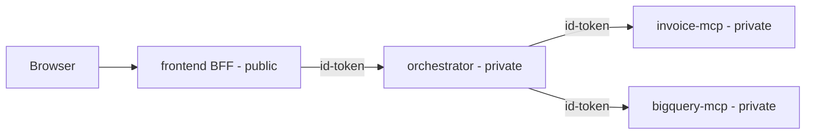

# frontend — MCP chat UI (Cloud Run)

A minimal, self-contained **backend-for-frontend (BFF)** that serves a chat UI
and proxies questions to the orchestrator. It is deployed as its **own Cloud
Run service**, independent of the backend and the MCP servers.

## Why a BFF and not a static site?

The orchestrator is deployed `--no-allow-unauthenticated`, so a browser cannot
call it directly. This service mints a Google **identity token** server-side
(audience = orchestrator root URL) and forwards the request. The token never
reaches the browser.

## Topology (four independent Cloud Run services)



| Unit | Folder | Cloud Run access |
|------|--------|------------------|
| Frontend UI | `frontend/` | `--allow-unauthenticated` (or put IAP in front) |
| Orchestrator backend | `orchestrator/` | `--no-allow-unauthenticated` |
| Invoice MCP | `invoice-mcp/` | `--no-allow-unauthenticated` |
| BigQuery MCP | `bigquery-mcp/` | `--no-allow-unauthenticated` |

## Endpoints

- `GET /` — chat UI ([static/index.html](static/index.html)).
- `POST /api/ask` — `{ "question": "..." }` → proxied orchestrator response
  (answer, routing, model_used, proof).
- `GET /healthz`, `GET /readyz`.

## Configuration (env vars)

| Var | Purpose | Default |
|-----|---------|---------|
| `ORCHESTRATOR_URL` | orchestrator root URL (no `/ask`) | (required) |
| `USE_AUTH` | mint identity token for the orchestrator | `true` |
| `REQUEST_TIMEOUT` | seconds to wait for the backend | `180` |
| `PORT` | bind port (Cloud Run injects) | `8080` |

## Run locally

```powershell
# With the orchestrator running locally on :8080 without auth:
$env:ORCHESTRATOR_URL = "http://127.0.0.1:8080"
$env:USE_AUTH = "false"
$env:PORT = "8090"
pip install -r frontend/requirements.txt
python frontend/app.py
# open http://127.0.0.1:8090
```

## Deploy to Cloud Run

```powershell
gcloud builds submit ./frontend --config frontend/cloudbuild.yaml `
  --substitutions=_REGION=us-central1,_REPO=mcp-servers,`
_ORCHESTRATOR_URL=https://orchestrator-xxxx.run.app
```

### Required runtime IAM (frontend service account)

```powershell
# Allow the frontend to invoke the private orchestrator.
gcloud run services add-iam-policy-binding orchestrator `
  --region us-central1 `
  --member "serviceAccount:<frontend-runtime-sa>" `
  --role roles/run.invoker
```
