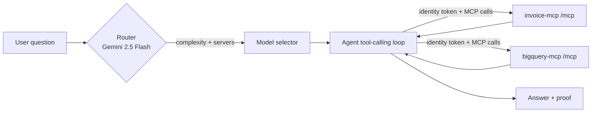

# orchestrator — MCP agent backend

The **orchestrator** is the Cloud Run backend that sits in front of the MCP
servers. It receives a user question, decides how hard it is and where to send
it, runs a Google model that drives the MCP tools, and returns a natural-language
answer **plus the actual tool outputs as proof**.

> Architecture correction: MCP servers are *tool providers* — they do **not**
> take "a question + a model". The LLM reasoning and tool orchestration live
> here, in an MCP **client**. This backend is that client.

## Request pipeline



1. **Router** ([services/router.py](services/router.py)) — Gemini 2.5 Flash returns
   structured JSON: `complexity` (simple/moderate/complex) and target
   `servers` (invoice / bigquery).
2. **Model selection** ([config.py](config.py)) — complexity → model:
   - `simple` → `gemini-2.5-flash-lite`
   - `moderate` → `gemini-2.5-flash`
   - `complex` → `gemini-2.5-pro`
3. **Agent loop** ([services/agent.py](services/agent.py)) — advertises the chosen
   servers' MCP tools to the model, executes each tool call against the server
   via [mcp_gateway.py](mcp_gateway.py), and feeds results back until a final,
   grounded answer is produced.
4. **Response** ([schemas.py](schemas.py)) — `answer`, `model_used`, `routing`,
   and `proof[]` (the raw tool results that back the answer).

## API

`POST /ask`
```json
{ "question": "What tax was applied to invoice INV0029?", "session_id": "optional" }
```
Response:
```json
{
  "answer": "...natural language...",
  "model_used": "gemini-2.5-flash",
  "routing": { "complexity": "moderate", "servers": ["invoice"], "reason": "..." },
  "proof": [ { "server": "invoice", "tool": "knowledge_read_file", "arguments": {...}, "result": {...} } ],
  "request_id": "..."
}
```
Health: `GET /healthz` (liveness), `GET /readyz` (config readiness).

## Configuration (env vars)

| Var | Purpose | Default |
|-----|---------|---------|
| `GCP_PROJECT` | Vertex AI project | (required) |
| `VERTEX_LOCATION` | Vertex AI location | `us-central1` |
| `INVOICE_MCP_URL` | invoice-mcp endpoint, incl. `/mcp` | — |
| `BIGQUERY_MCP_URL` | bigquery-mcp endpoint, incl. `/mcp` | — |
| `ROUTER_MODEL` | routing model | `gemini-2.5-flash` |
| `MODEL_SIMPLE` / `MODEL_MODERATE` / `MODEL_COMPLEX` | model per complexity | flash-lite / flash / pro |
| `MCP_USE_AUTH` | mint Cloud Run identity tokens for MCP calls | `true` |
| `MAX_TOOL_ITERATIONS` | max tool-calling rounds | `6` |

## Run locally

```powershell
$env:PYTHONPATH = "$PWD;$PWD\orchestrator"
$env:GCP_PROJECT = "gcp-eds-finance-user-dev"
$env:VERTEX_LOCATION = "us-central1"
$env:INVOICE_MCP_URL = "http://127.0.0.1:8082/mcp"
$env:BIGQUERY_MCP_URL = "http://127.0.0.1:5000/mcp"
$env:MCP_USE_AUTH = "false"   # local servers are unauthenticated
pip install -r orchestrator/requirements.txt -r shared/requirements.txt
python orchestrator/app.py
# then: POST http://127.0.0.1:8080/ask
```

## Deploy to Cloud Run

```powershell
gcloud builds submit . --config orchestrator/cloudbuild.yaml `
  --substitutions=_REGION=us-central1,_REPO=mcp-servers,`
_INVOICE_URL=https://invoice-mcp-xxxx.run.app/mcp,`
_BIGQUERY_URL=https://bigquery-mcp-xxxx.run.app/mcp
```

### Required runtime IAM (orchestrator service account)

The orchestrator calls Vertex AI and calls the two MCP services (deployed with
`--no-allow-unauthenticated`), so its runtime service account needs:

```powershell
$SA = "<orchestrator-runtime-sa>"
# Vertex AI (Gemini)
gcloud projects add-iam-policy-binding $PROJECT --member "serviceAccount:$SA" --role roles/aiplatform.user
# Permission to invoke each MCP service
gcloud run services add-iam-policy-binding invoice-mcp  --region us-central1 --member "serviceAccount:$SA" --role roles/run.invoker
gcloud run services add-iam-policy-binding bigquery-mcp --region us-central1 --member "serviceAccount:$SA" --role roles/run.invoker
```

The identity token minted per request uses the target service's **root URL** as
its audience (see [mcp_gateway.py](mcp_gateway.py)).
